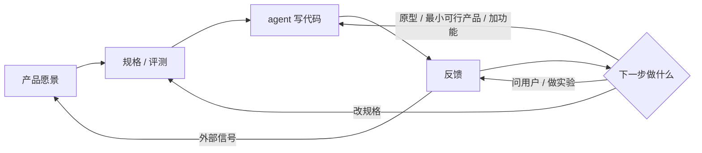

## 一句话结论

Andrew Ng 认为 **编码 agent 已经越来越会按规格实现，工程师真正稀缺的工作变成：决定规格里该写什么，并驱动「写代码 → 拿反馈 → 决定下一步」这个循环。** 他称之为 shaping the build：不只把别人写好的规格做出来，还要参与规定要做什么。

## 一张图看懂

循环由人驱动。agent 负责内圈实现；人负责选下一步，并把用户和市场信号写回愿景。

## 核心观点

### 1. 规格写得清楚之后，实现不再是稀缺步骤

Andrew Ng（[The Batch，2026-09-11](https://www.deeplearning.ai/the-batch/the-ai-engineering-skills-map-in-detail-shaping-the-build)；X：[AndrewYNg](https://x.com/AndrewYNg/status/2098459474608672916)）：

> When you're skilled at AI Engineering, your best work won't be merely implementing a product that someone else spec'ed out. Instead, you will actively shape the build.

8 月总图（[The AI Engineering Skills Map Part 1](https://www.deeplearning.ai/the-batch/the-ai-engineering-skills-map)）把同一判断写得更硬：

> Thus, our work as engineers is shifting toward deciding what should be in the spec.

否定的旧假设是：产品经理和设计师给出像素级设计，工程师只负责实现。agent 把「按规格交付」这条腿变快之后，卡在规格从哪来、下一步试什么。

这是四项 AI Engineering 技能里的第四项。另外三项是：构建并部署 AI 应用、软件工程基本功、使用编码 agent。连续学习压在四项下面，不是单独一项。

### 2. 驱动构建循环：人要选下一步，不是把循环交给模型

软件仍然是：写一点代码 → 拿到反馈 → 决定下一步。Ng 要工程师以行动偏好、以 AI 现在允许的速度去**开这个循环**，而不是等一张完整工单。

循环里要做的选择包括：

- 快速原型，验证技术想法或用户功能
- 最小可行产品，拿去给用户看价值
- 加功能，还是投入企业级系统
- 小批次交付，保住速度
- 何时问用户 / 干系人，何时做技术实验（例如训练一个模型）
- 成熟产品：定义关键指标，并按指标推进改进

权衡项是愿景、项目阶段、可行性、风险、工作量和预算。否定的旧假设是：下一步永远由产品经理排期，工程师只接单。

### 3. 做产品决定：规格盖不住的地方，工程师也要能下判断

> Developers don't have to become PMs, but you will make decisions the product spec doesn't cover.

没有规格时，要能自己起草一份。判断落在三层，底层是用户同理心：

- 产品感觉：方向对不对得上真实需求
- 基本设计感觉：能用之外还要好用
- 基本商业感觉：上市路径、市场规模、单位经济、损益

同理心靠持续磨：两三场非正式访谈、上百份问卷、大规模 A/B，或分析成千上万用户行为。产出不是「更懂用户」的感觉，而是下一轮循环的输入。

### 4. 沟通和领导：范围变宽之后，对齐变成工程工作

AI 工程不再停在全栈实现。营销、财务、法务都会卡项目。把可行性讲给非工程师听，帮组织改掉对 AI 的错误心智模型，是推进项目的一部分，不是额外的软技能课。

否定的旧假设是：跨职能对齐是项目经理的事，工程师把技术做完就行。

### 5. 高能动性：方向不清时，先发现问题再做完

许多管理者（包括一部分高管）仍不清楚 AI 能做什么，给不出精确的自上而下指令。技术上跟得上的人可以在组织约束里：发现问题、提出方案、做完。标准是创造的价值，不是关掉的工单。

同时要持续投资技能、工具和工作流——前沿在动，工作流也要动。

Ng 的收束：

> The opportunity to not just build but to shape the build makes AI Engineering more exciting

更有权、范围更大、要做的决定更多，技能集也更大。DeepLearning.AI 的重点是帮人长出这些技能，而不是再发明一个岗位名。
