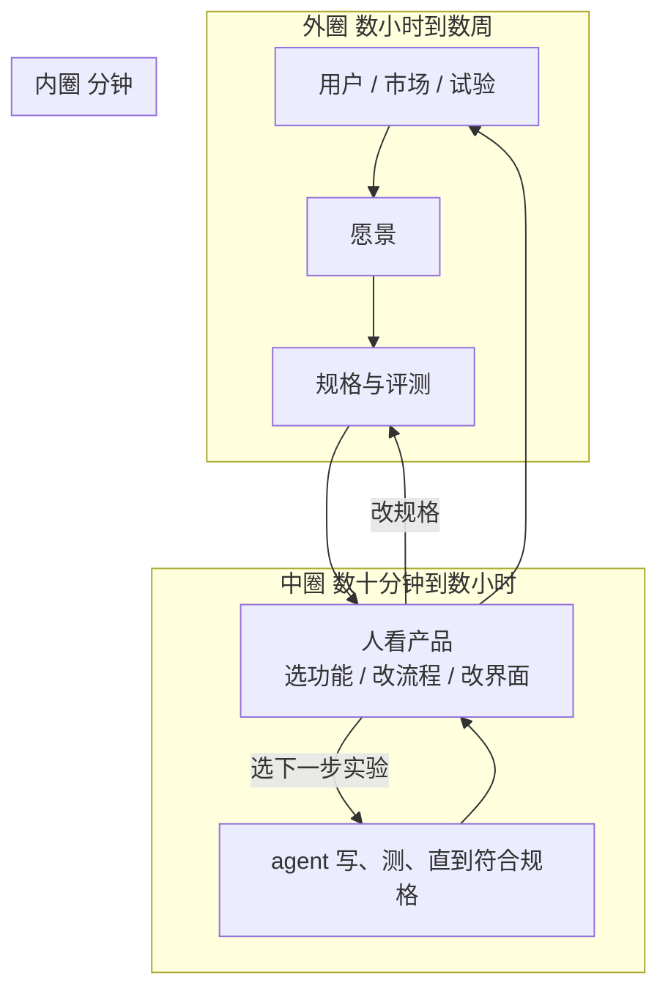

## 一句话结论

Andrew Ng 认为 **编码 agent 按规格交付之后，稀缺的不再是实现，而是谁来改规格、以什么节奏改。** shaping the build 不是「工程师也要懂一点产品」，而是把构建看成三层嵌套循环：agent 在分钟级把规格写成能跑的东西，人在小时级用自己比模型多知道的用户与现场信息改下一步，外部信号在数天到数周改愿景。人的贡献他不叫品味，叫情境优势。

## 一张图看懂

内圈可以越来越少人盯缺陷；中圈才是 Ng 说的 shaping。外圈不转，中圈只是在旧愿景上加速。

## 核心观点

### 1. 规格一旦写清，实现从最贵的一步变成循环里最快的一圈

X 帖（[AndrewYNg](https://x.com/AndrewYNg/status/2098459474608672916)）链到 2026-09-11 的 Batch 信 [Shaping the Build](https://www.deeplearning.ai/the-batch/the-ai-engineering-skills-map-in-detail-shaping-the-build)。8 月总图 [Skills Map Part 1](https://www.deeplearning.ai/the-batch/the-ai-engineering-skills-map) 先把话说死：

> Thus, our work as engineers is shifting toward deciding what should be in the spec.

九月信把同一判断写成工作定义：

> When you're skilled at AI Engineering, your best work won't be merely implementing a product that someone else spec'ed out. Instead, you will actively shape the build.

旧分工是发明（产品、设计）和实现（工程）分开，工程等一张像素级稿再开工。Ng 说这条线在糊：工程师加入规定要做什么，产品和设计师也开始能出代码。糊的收益不是岗位合并，是 **不必每一步都等产品经理想清楚再动**：

> you can move faster without waiting for a PM to figure out what to do.

这是四项 AI Engineering 技能的第四项。前三项（构建并部署 AI 应用、软件工程基本功、使用编码 agent）解决「怎么把不确定的模型接进能跑的系统」；这一项解决「系统会跑之后，下一步试什么」。连续学习压在四项下面，不是第五项技能。

和 [[Anthropic：The AI-native SDLC playbook]] 切的不是同一层。Anthropic 说代码不再是瓶颈，所以计划、审查、发布必须改成可触发的工件闸门——那是组织制度。Ng 说规格写清之后，**个人**还要能开循环、填规格盖不住的判断。没有闸门，循环没有审计；没有人开循环，闸门里流过的是别人写好的规格。

### 2. 真正要驱动的不是一张流程图，是三种不同时钟的循环

九月信把日常工作写成：写一点代码 → 拿反馈 → 决定下一步。具体分叉是：快速原型（技术想法或用户功能）、最小可行产品拿去给用户看价值、加功能还是上企业级系统、小批次交付保住速度、问用户/干系人还是做技术实验（例如训练一个模型）、成熟产品则定义指标并按指标推进。权衡项是愿景、阶段、可行性、风险、工作量、预算。

这些分叉如果平铺，只是一份产品经理清单。机制在 6 月 26 日的前序信 [Three Key Loops for Building Great Software](https://www.deeplearning.ai/the-batch/three-key-loops-for-building-great-software)：

| 圈 | 谁 | 时钟 | 干什么 |
|---|---|---|---|
| 编码 agent | 模型 | 分钟 | 按规格（可加评测）写、测、直到符合且无缺陷 |
| 开发者反馈 | 人 | 数十分钟到数小时 | 看产品，改下一步：功能、界面弱在哪、用户流该怎么走 |
| 外部反馈 | 用户 / 市场 | 数小时到数周 | 朋友、内测、生产 A/B；结果改愿景，愿景改规格 |

去年开发者（包括 Ng 自己）还在给 agent 当 QA，手工找缺陷。agent 开始能自测之后，这块时间明显下降，人被推到中圈做更高层的产品决定。外圈不转，中圈只是把旧愿景实现得更快——这就是「驱动构建循环」和「让 agent 多跑几轮」的差别。

和 [[Warp：How Warp builds self-improving agents on Claude]] 的闭环也不在同一层。Warp 的外圈读的是团队已经在用的 PR / issue / Slack，沉淀进 skill 文件；Ng 的外圈读的是用户和市场，沉淀进愿景和规格。一个改执行系统，一个改要做成什么。

### 3. 人留在中圈，是因为比模型多知道用户和现场，不是因为更有品味

规格盖不住的地方，工程师也得下判断；没有规格时要能自己起草一份。判断落在产品感觉、基本设计感觉、基本商业感觉（上市路径、市场规模、单位经济、损益）。底层是用户同理心，而且有尺度：两三场非正式访谈、上百份问卷、大规模 A/B、或成千上万到百万级行为数据。产出不是「更懂用户」的自我感觉，而是下一轮中圈的输入。

六月信把这件事从气质改成机制：

> Many people describe this human contribution as “taste,” but I prefer to think of it as humans having a context advantage

人比当前 AI 系统多知道用户是谁、产品在什么现场里运转。只要这个差还在，中圈就不能全交给模型——不是原则问题，是信息差。这和「工程师必须改行做产品经理」不是同一句话：不必换岗位，但规格空白处的决定已经落在写代码的人身上。

### 4. 范围变宽之后，对齐和能动性变成循环能不能转的条件，不是软技能课

中圈要动，常常卡在工程墙外：营销、财务、法务。Ng 的原句是工程师要能 explain why certain initiatives may be technically feasible or not。把可行性讲给非工程师听，帮组织改掉对 AI 的错误心智模型，是让循环继续的工作，不是额外的沟通课。

另一头，许多管理者仍不清楚 AI 能做什么，给不出精确的自上而下指令。技术上跟得上的人可以在组织约束里发现问题、提出方案、做完。标准是创造的价值，不是关掉的工单；同时要跟着前沿改自己的工具和工作流。Ng 把这写成高能动性：不是性格赞美，是 **方向不清时循环的启动条件**——没人开第一圈，三层图只是一张静图。

收束仍是技能地图，不是新岗位名。DeepLearning.AI 要帮人长出这些技能。比实现规格更有权、范围更大、要做的决定更多，技能集也更大。
