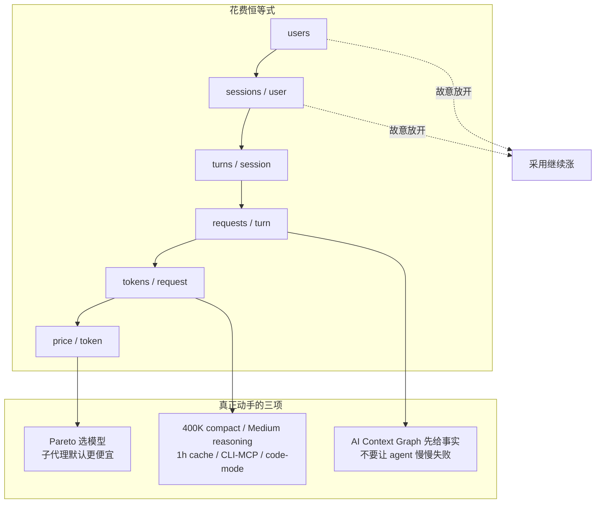

## 一句话结论

Uber 认为 **AI 写代码的账单不是采购问题，是工程问题**：用量可以涨 7 倍，只要把「零价值 token」从请求里抠掉，并把工作从成千上万次交互式终端，迁到带 benchmark、带 Pareto 模型的托管 agent 舰队。人仍在审查和升级闸门上，循环自己转。

## 一张图看懂



## 核心观点

### 1. 「归因于 agent」不是无人值守发车，是流水线里有 agent、人在审查和升级

Uday Kiran Medisetty（Uber Distinguished Engineer，[Running a Software Factory Efficiently at Uber Scale](https://www.uber.com/es/en/blog/efficient-software-factory/)，2026-08-27；X：[UberEng](https://x.com/UberEng/status/2093444169037762840)）开篇：

> AI tools are now embedded in every phase of software development at Uber.

关键数字：

| 指标 | 值 |
|---|---|
| 归因于本地或云端 agent 的 PR | **>70%** |
| 员工自建 agent skill | **3,600+** |
| skill 执行 | **30,000+/天** |
| 周活（2026-02 到 8 月中，跨工具去重） | **7x** |
| 每周 agent 请求 | **9.4x** |
| 总 AI 花费 | 4 月后相对持平 |
| 固定模型后，每 1,000 次请求成本 | 峰值 **-34%** |
| 固定模型后，每次 session 成本 | 6 月峰值 **-52%** |

「归因」的意思是：agent 进了 PR 流水线，人仍审查、仍升级。不是合入前没人看。越来越多 session **不是人点开的**：托管 agent 做 code review、自愈 CI、带视觉校验的端到端 PR、on-call 分诊、进线 bug 调试、维护。人在审查和升级处介入。

他们按公开标价记账，收益来自标准档位里的路由，不是私下折扣。方法可搬：用真实工作做 benchmark，同时拧准度和成本。

### 2. 四层工厂之上，真正能拧的是恒等式中间三项

用法按四层排，从专用到通用；越高的层，对成本、质量和选哪只模型握得越紧。图形按 generation / validation / deploy / observation / maintenance 分组。

花费拆成六个相乘项：

```text
users × sessions/user × turns/session × requests/turn × tokens/request × price/token
```

前两项是采用和参与，**故意继续涨**（人自己用，或 agent 替人跑）。中间三项才是优化面：规划、空转、报错、膨胀输入——工程师原始请求之外的额外功。`price/token` 主要是路由选择，不是跟供应商砍价。

旧假设是「模型越来越便宜，账单自然下去」。Uber 的假设反过来：**用量会把单价下降吃掉，必须按工程问题拆因子。**

### 3. 度量按结果计价，不按「看起来用了很多」计价

每周 / 每月看五层：

| 层 | 回答的问题 |
|---|---|
| 组合 | 钱去哪了，哪只工具在动 |
| 单工具单位经济 | 变便宜了，还是 mix 变了 |
| 每只模型 | 哪次发版真的动了账单 |
| 顺序分解（无残差） | 采用 → 参与 → 输入 token/请求 → 输出 token/请求，数字为什么动 |
| 托管 agent 结果 | 每个合入 PR / 每次审查 / 每次告警 / 每次清理的成本；revert、F1、MTTR |

托管 agent 盯的是 **outcome-denominated cost**：同样质量下，单位产出更便宜。换模型时质量要扛住。

### 4. 供应商定 token 价，他们定哪只模型干哪类活

> The vendor sets the token price. We pick which model runs which workload.

Pareto 在这里是：做完一件真任务的成本 × 输出质量 × 可靠性。每只托管 agent 同一套四步：用它的真实工作建 benchmark → 一个 harness 后面挂所有前沿 / 开源模型 → 站到当前 Pareto 点并跟着前沿挪（几周就变）→ 以后用聚合轨迹试路由策略。

例子：

- **uReview**（每条 PR 都过 AI 审查）：用带已知 bug、标了 easy/medium/hard 的真 PR 当集。看 precision / recall / F1，以及 cost/review、延迟、超时、噪声。换模型后 F1 升、cost/PR 降。散点上虚线是 Pareto 前沿，左下都被支配。
- **Uber SWE Benchmark**：数千条大 monorepo 真 PR，多种任务，给所有 SDLC 托管 agent 选模型。

交互式默认两只旋钮：开场模型和子代理模型。子代理默认是更大杠杆，而且在涨——编排越好，session 越爱派子代理。子代理拿的是窄、说清的活，常常不需要前沿推理，所以默认更便宜（可手改）。主模型拆解和评判，子代理干活。

这否定的是「全舰队默认最强模型」。

### 5. 每次 turn 都重放历史，砍 payload 会复利

即便窗口是 1M，他们 **400K 就 compact**，换一点质量，挡住 cache 爆冲和反复按输入计价。推理默认 **Medium**：主模型上输出（含隐藏推理）按输入的倍数计，Medium 被判断适合一大类任务。

Prompt cache：后续 turn 读前缀大约 **0.1×** 输入价。写入：5 分钟条目 1.25×，1 小时 2×。TTL 必须对齐空闲间隔。交互式工程师经常闲超过 5 分钟，5 分钟 cache 一断就要原价重建前缀，所以**主线程改 1 小时 TTL**；子代理短、单任务，仍 5 分钟。

MCP 不把 schema 灌进上下文。1,000+ 内部和 SaaS MCP 走同一网关做认证和策略。原版 MCP 会把每个 tool schema 塞进每次 session：大约 100 个工具就要 **50–70K schema token**，然后每个 turn 再寄一次。两刀：

1. **CLI 解析**：模型 shell 出去，CLI 调用时打网关。Uber MCP schema 离开窗口，1,000+ 网关工具都呈现为 CLI 命令。
2. **Tool search**：目录搜索，只加载用到的。schema token 下降，库变大时选对率还能撑住。

**Code-mode**：工具变成 shell 命令之后，模型可以把多步动作打成一个脚本。啰嗦的 MCP 否则每跳一轮（发出、倒原始结果、再想）。仓库查询可能提交、轮询 2–5 次、再取数。Code-mode 把这个环放进 Python 子进程，**只回摘要**。同五条 SQL、同一 Claude Code session：

| 查询 | LLM tool-use | Code-mode | 节省 |
|---|---|---|---|
| `SELECT 1`（1 行） | 903 | 402 | 55% |
| `COUNT(*)`（1 行） | 954 | 403 | 58% |
| `GROUP BY LIMIT 20`（20 行） | 1,600 | 457 | 71% |
| `SHOW COLUMNS`（175 行） | 2,200 | 900 | 59% |
| 宽表 `SELECT *`（50 行） | 1,431,594 | 900 | ~100% |

小结果也省 50% 以上，省的是 schema 初始化、轮询 turn、逐步推理，不只是巨大 payload。批量活把 N 次模型 turn 收成一个脚本，可超过 90%。25+ 预置 code-mode skill 罩住最热 MCP，常见路径默认走便宜路线。

SaaS MCP 更夸张：一个 workspace 服务器 49 个工具、约 22K schema token；消息 34；项目跟踪 46。两三台服务器就能在第一句 prompt 之前压过正在编的文件。同样走网关 + CLI 投影，再给常见流配 code-mode skill。

### 6. 没有接地的 agent 失败得很慢，不是很便宜

> An ungrounded agent fails slowly rather than cheaply.

它会不停扩上下文，再搜一个地方。最强的一刀是**先把更好的事实塞进去**。

Uber 代码和数据面是数亿行、数千张表；agent 大部分 turn 在找东西，不在写。**AI Context Graph**：2,400 万节点、8,000 万边、86 种节点、117 种边，30+ 内部系统喂（服务、团队、事故、PR、设计文档、部署、数据集、历史表使用查询）。agent 用自然语言查。

同一 prompt、同一模型：图路径 **38 秒且正确**；未接地路径 **20 分 09 秒且错**。接地那次用了历史使用，找到 50+ 分析师已经在用的表。未接地那次读了 20 分钟服务代码、派了 2 个子代理、撞了 3 次错，然后宣称数据集不可查。

这否定的是「给更大窗口、让它自己逛」。逛的代价按 turn 计，而且经常逛错。

### 7. 可见性是 nudge，不是硬帽；反模式按美元标价

状态栏直播本 harness 和该用户所有 harness 的花费，带着 session 分析器和效率指南。档位是 nudge：

- 终端里一直开着 session 成本
- 交互式 harness 共用一个池，托管 agent 另池
- 预期花费的 50 / 80 / 100% 打 Slack
- 升档走经理快签
- 「cost check」skill + 状态栏教练，让人自己判断这笔任务的 ROI

Session 分析仪表盘运行时就开，不用报名。一只 cost-dashboard skill 读本地和远端沙箱、所有 harness 的轨迹。它不打一个总分，而是标 **16 种反模式**，每种带美元影响和修法。例如：简单多轮活开在 Opus 上、Sonnet 就够；肥 MCP 回复（如 40KB）留在上下文里反复计费；长暂停后 cache 过期、前缀原价重建；用户字出现前已经有约 100,000 token 的系统 / 工具前言。

样例仪表盘：总花费 $4,162.07，433 个 session，cache 命中 95%，未命中成本 $1,097.82，节省 $1,213.87。

### 8. 战略迁移是：从调几千个终端 session，到养一支带 eval 的托管舰队

收束：

> Managing and curbing rising AI coding expenses is also a tractable engineering challenge.

他们砍零价值 token，而不是只追更便宜单价或更弱工具。用量 7x，单位成本全线下降，质量持平或更好。

> The core strategic shift is moving from interactive developer workflows to fully managed agents.

托管环境自己握路由、harness 和花费。一支专用 agent 舰队，每只带自己的 eval 和 Pareto 模型，比调几千个个人终端 session 更便宜、更能扩。下一步：按「结果指标 + eval 集 + Pareto 模型」配方扩舰队；动态路由；让更自主的 agent 查图；session 分析从批扫描变成连续轨迹；从轨迹自动抓住 skill 纸伤并生成补丁。

和 [[Warp：How Warp builds self-improving agents on Claude]] 同一方向：skill 是可进化文件。Uber 补的是另一层——**工厂级成本恒等式和选模 Pareto**，让规模先别把账单撑爆。
