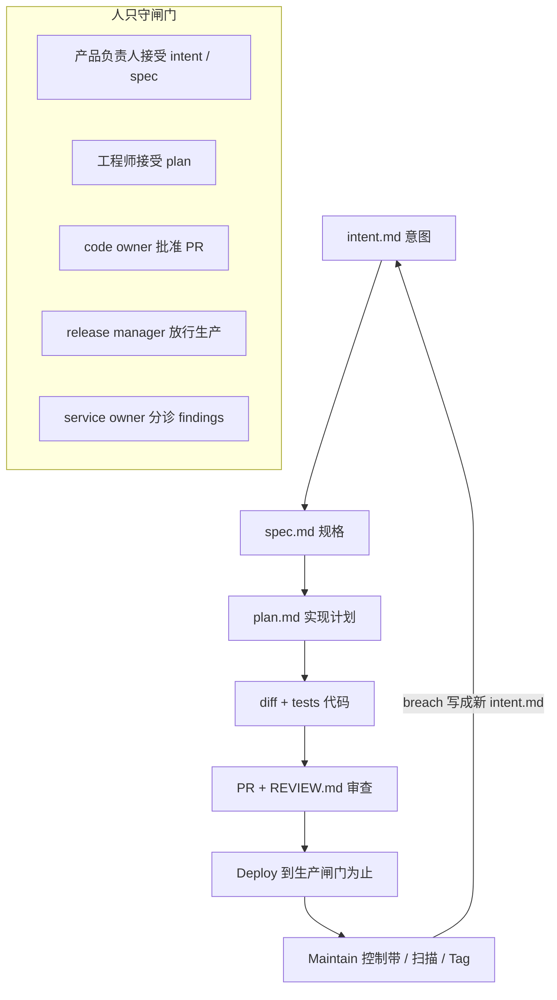

## 一句话结论

Anthropic 认为 **代码已经不再是瓶颈，卡死产出的是还在按人类速度运转的计划、审查、测试、发布和运维。** AI-native SDLC 不取消旧控制目标，只改执行方式：每个阶段提交一份人能读、机器能接着干的工件，接受这份工件就触发下一阶段；人留在闸门上做判断，循环自己转。

## 一张图看懂

## 核心观点

### 1. 代码不再是瓶颈，旧 SDLC 的控制是按「写代码最贵」设计的

Louis Claxton（Anthropic Applied AI，2026-08-21）开篇第一句：

> Code is no longer the bottleneck.

团队用 Claude Code 这类 agentic 工具，已经能以一年前不可想象的速度产代码。周围的流程没跟上：审批闸门、审查、交接、政策，仍按人类速度节流。

经典 SDLC 六段——计划、设计、构建、测试、发布、维护——每段通常由不同角色拥有，工作靠文档、工单、签字移动。它很重，是为了问责。前提是：**写代码、实现代码是最慢最贵的那一步。** PRD、估点、产品安全评审，存在的理由是要在数周到数季度的构建里对齐。

这个前提碎了。构建塌成小时级，另外三段后果立刻出现：

- 约束跑到构建的左边和右边：计划、审查/测试、发布，仍是人类速度
- 控制不再匹配现实。人逐行审查在「人写代码」时合理；agent 产出大部分 diff 时跟不上
- 治理成本上升，因为例外仍走每周/每月才开一次的委员会

安全是被展开的例子。安全团队按人类吞吐编制。agent 把产出乘上去之后，要么审查队列爆炸，要么代码带着欠审上船。受监管公司两样都不能接受，所以安全和策略检查必须跟得上 agent。

一句话：**实现阶段已经 agent 化了，生命周期的其余部分必须得到同样的改造，否则增益会被旧闸门吃掉。**

对照内部实践：[How Anthropic secures its AI-native SDLC](https://claude.com/blog/how-anthropic-secures-its-ai-native-software-development-lifecycle) 里，Claude 已撰写约 80% 合入代码，工程师每季度产出约为 2021–2025 的 8 倍。瓶颈按 Amdahl 定律转移到验证、审查和安全。

### 2. AI-native 不是取消控制，是把线性管道改成循环，把强制方式从会议改成工件

定义很克制：保留旧控制目标，改变强制方式。流程变成 loop 而不是 line，AI 出现在每一个点。笨重的阶段交接，被「自动移交并触发下一出戏」替换。

同一件事也被叫做 agentic SDLC / AI SDLC / agentic software development。

贯穿 AI-native 一侧的主线是 **已提交的工件**。每个阶段结束时往版本控制里写一份（`intent.md`、`spec.md`、`plan.md`、diff 和它的测试、带审查发现的 PR、事故记录）。下一阶段从读它开始。早期阶段多用 `.md`，好让产品负责人和 agent 对着同一份文件读和做。从 Build 起，工件变成代码及其记录。

> Every stage commits an artifact the next stage can read.

commit 链就是审计轨迹：谁提出、agent 产了什么、谁批准。

人仍然对每个需要判断的决策负责。注意力跟着必须被审查的工件走，而不是从头把每个阶段做一遍。

终态不是「每一步都手打 prompt」，而是：**一份被接受的工件点燃下一道闸门。**

### 3. 六段对照：传统在交接里丢信息，AI-native 在文件里保信息

| 阶段 | 传统 | AI-native |
|---|---|---|
| Plan | 委员会靠工作坊和签字收集需求，写稿靠人 | Claude 从来源合成痛点，写成 `intent.md`——人能读，机器能接着干 |
| Design | 分析师写规格，设计师再解析一遍 | 需求和设计压进一次 agent session，标准写成 skills 进 git |
| Build | 测试和代码手写，文档事后补 | AI 生成测试和代码；制度知识活在版本化的 `CLAUDE.md` 和 skills 里 |
| Test | 阶段边界上的 QA 闸门 | 连续 eval 织进实现过程 |
| Deploy | 人逐行审查；治理靠审查周期，常常不一致 | 多层 agentic 审查；人留给受监管/关键代码。治理在 AI 行动时强制，hooks 当批准闸门 |
| Maintain | 人盯生产找 bug | Agent 监视线上。控制带被突破后诊断，写回循环，成为新的 `intent.md` |

出戏（plays）是手册的本体。每出戏写清：改了什么、如何起步、具体步骤、治理、怎么衡量是否有效。步骤模块化，组织可以按不同顺序改造各阶段。依赖写在 Prerequisites 里，也画在依赖图上——**采纳顺序不等于阶段顺序。** 从任何「黏土戏」开始（没有箭头指进来，不需要先做别的）；其他戏先做指进来的那些。

### 4. Plan：意图一旦写成 `intent.md`，就不再等人「帮你写进 backlog」

想法不再等某个人把它写正式。意图用提出者自己的话捕获一次，成为下一阶段能执行的版本化工件。

入口可以是人有想法、工单被提交、或事故告警（见 Stage 6）。人有想法时，和 Claude 一起头脑风暴，产出 markdown 原型规格，存成 `intent.md`。

传统路径里，这个人还得说服产品一起写或替他写。然后主意要穿过 backlog、用户故事、故事点和 refinement 会，所有权在每次交接时换人，工程拿到的已经离提出者原意隔了好几步。

AI-native：提出者自己的词写成 proto-spec，包含要什么、为什么、在哪些约束下。重复过程用 skills 编码。

关键治理：**无论意图来自事件触发还是 agent，产品负责人都要在提交前审查并修正 agent 写的 `intent.md`。**

基础设施刻意降低 Git 门槛：

- 单产品最简单的家是产品仓库里的 `intent/` 目录，让工件链挨着派生代码
- 意图跨很多仓库时才值得单独意图仓；monorepo 里就是一个目录
- 不会用 git 的人不必直接用 git。连接器（如 GitHub）让 Claude 从 claude.ai 或 Cowork 代为提交 markdown

领先指标：第一次对话到提交 `intent.md` 的时间，从数周的 elicitation 掉到小时。
滞后指标：产品负责人接进 Stage 2 而不是关掉的存活率；同一改动在第一份 `spec.md` 提交之后还改了多少次 intent。

这是手册里最有组织含义的一刀：**谁都可以当 originator，包括非工程师。** 产品不再垄断「把想法写成可执行物」的入口。

### 5. Design：需求和设计压进一次 session，政策在写规格时就应用

产品负责人批准后，Claude 拿着被接受的 `intent.md`，在品牌、安全、合规、UX 的 skills 约束下写出需求和设计规格。产品负责人审查规格，但不写规格。目标是一份工程能拿来做计划的 spec，并把担心的地方标出来。

前端是最清楚的例子：`intent.md` 被接受后，产品负责人在 Claude Design（beta）里从 intent 出 mock，迭代，再导出到 Claude Code 去构建。

传统把需求和设计拆成两个团队的两个阶段，为了问责，但慢而且损耗。AI-native 里，分析师会升级的那些点，变成 spec 里被 flag 的 concerns，产品负责人先和对应政策负责人逐条解决，**工程看到 spec 之前政策冲突已经处理。**

提示词的关键句是：在互相矛盾的政策无法同时满足的地方，必须明确写出来。

领先指标：同一改动从 `intent.md` 提交到 `spec.md` 提交的间隔。
滞后指标：构建开始后的需求返工——第一份 `plan.md` 之后还出现的 `spec.md` 提交。

### 6. Build：没有被接受的计划，就不实现；制度知识变成 agent 开局必读的文件

工程师默认从 Claude Code 的 plan mode 开始，把 Stage 2 批准的 `spec.md` 给它，让它访谈、迭代，直到工程师对计划满意。

传统：工程师读完设计就开始写。改哪些文件、写哪些测试，留在脑子里或最多留在工单评论里。别人审不了。审查者第一眼看到的是完成的 diff，那时返工已经贵。

AI-native：先有一份 plan mode 写出来的书面计划——Claude 可以读代码库，但不能改。工程师在写代码前纠正计划。批准版提交为 `plan.md`，供后面阶段对照。标准是：**一个从没看过那场对话的工程师，只凭计划就能实现。** 实现偏离计划时，同一 commit 里更新 `plan.md`。可以考虑用 hook 强制同步。

Plan mode 本身就是治理：Claude 在工程师接受计划之前不能编辑文件。常规改动工程师批；更高风险由 tech lead 或架构师批。

护栏分三层，这是整本手册的控制模型：

1. **`CLAUDE.md`：工作知识。** 新同事第一天需要的东西：构建/测试/lint 命令、真正要紧的约定、Claude 一直搞错的事。`/init` 生成后裁到一页以内，当代码一样进 git。工作规则：**Claude 把同一个错犯两次，修正写进 `CLAUDE.md`。** 它在每次 session 开头被整份读入，过期内容只烧上下文。
2. **Skills：制度政策，咨询性质。** 必须被一致应用的知识写成 skill（`SKILL.md` + 触发条件），放进 `.claude/skills/` 或经 plugin 分发。政策变，改 skill，政策负责人签字。skill 让 Claude 在写代码时就可能遵守政策，但**没有任何东西强迫一次 session 遵守。** 必须永远成立的政策，后面要跟确定性的 hook 或 PR 再检查。skill 让违规变稀有，hook 让违规接近不可能。
3. **Hooks：确定性允许/阻止。** 构建阶段最常打在文件编辑和 shell 上：挡住受保护路径、编辑后跑 formatter/linter、凭证不进 diff。构建期 hook 必须快、只针对刚改的文件。更重的检查放 commit 或 PR。**构建期不要弹出「请人批准」——那会把人重新放回所有并行 session 的关键路径。** 要人批的 hook 属于 Stage 5 闸门。

Auto mode：计划被批准后，Claude 不再逐次编辑都问。随着 `CLAUDE.md`、skills、hooks、可跑的测试套件成熟，对「规格紧、爆炸半径小、测试已覆盖」的常规工作，auto-accept 应变成默认。工程师的工作从盯着 agent 改，变成审更长自主 session 之后的工件。这是 Stage 6 能闭环的前提。

并行：一个工程师同时开几条流。parallel session 是另一份完整 Claude Code，在自己的 git worktree 里做另一件事，彼此不知情，唯一共享的是那个在steer 的人。subagent 是同一 session 里的scoped 帮手，自带上下文窗口和工具限制，适合跨任务重复的活（验证应用是否真的跑起来）。起步两三个 session；实际上限是一个人还能不能审得过来。

关于遗留系统，手册给了三条真理配置，适用于所有工件：

1. **仓库即真理。** markdown 权威，遗留系统引用 commit 里的文件。工程主导组织最干净。
2. **遗留系统即真理。** Jira / ServiceNow / 需求工具权威，markdown 是工作副本。Claude 开局读记录，同一 session 经 MCP 写回。
3. **最低限度：互链。** 所有工件注明记录 ID，所有遗留记录含 markdown 的 commit SHA。过渡期可接受两个真理。

必须点名一个系统当真理，其余持副本或链接。这和 Cursor / Zed「不替换 Git」是同一类现实感：审计师和监管已经接受旧系统，AI-native SDLC 必须绕着现存的长。

### 7. Test：session 先自检；steer agent 的配置要像代码一样回归

永远给 Claude 一条自证回路——测试、构建、或截图 diff。session 在工程师看见之前自己改自己的错。

不要把这和 Stage 3 的 verifier subagent 混为一谈：反馈环贯穿整项任务、跑多少次工作就跑多少次；verifier 是 session 自以为做完之后，用新鲜上下文做最终检查，以免裁决被写出这些代码的假设染色。

传统信号来得晚：CI 分钟后、测试员数天后、生产数周后。agent 产代码时，晚信号意味着人必须检查它的全部输出，这个人变成瓶颈。

执行要点：

- 今天要一串命令和环境知识才能检查的，包成一个非零退出的目标（`make test` / `npm test`）
- `CLAUDE.md` 里列出命令和健康输出样例
- 给可量化目标，Claude 不用问人（某文件全绿、截图匹配 mock、endpoint 200 且带新字段）
- 修 bug：先让 Claude 把 bug 复现成失败测试，提交测试，再让它在不改测试的前提下修代码；用 hook 禁止修 bug 时改测试文件。agent 改不了的、修复前就存在的测试，才是 bug 消失的证据
- UI：给浏览器或截图工具，对着 mock 迭代两到三轮
- 「完成」必须包含验证，指令写进 `CLAUDE.md`
- **保护回路本身：修代码的 agent 不能削弱检查。**

另一半测试是 **continuous evals**：agent 配置（`CLAUDE.md`、skills、hooks）一变就跑的套件，相当于 AI-native 的阶段门 QA。换模型或改 prompt 时，套件回答 agent 是否还按同一标准干活。平台工程师收集 20–50 个近期真实任务，写成 prompt + 可接受检查。每个生产事故由责任团队写成 eval，留在套件里当回归。通过率当 merge check。

配置变更要过这道门：一个让通过率下降的 skill 变更，合入前必须被审查。

### 8. Deploy：审查双向跑；agent 做到生产闸门为止，绝不越过去

Claude 既给审查也收审查。它按组织政策审进来的 PR，也在自己的 PR 上处理评论。工程师把注意力放到行为上——判断意图和风险。

传统审查容量按人类产出规划。PR 等人读完；质量随负载起伏；作者追着 backlog 长。AI-native：所有 PR 走同一套审查 pass，发现按严重度排序。人的注意力上移一层：这次改动是不是计划里要的，风险能不能接受。

`REVIEW.md` 把政策写成 pass：bugs / 逻辑错误；安全；对照 `spec.md`、`plan.md` 和设计原则的合规。定义 Important vs Nit，以及跳过什么。发现本身不批准也不阻断 PR；branch protection 仍要 code owner 批准。平台工程师如果想用发现卡 merge，可以读 check run 发布的机器可读严重度计数。

硬规则：

> The agent that wrote the code has no way to approve it.

职责分离被保住。写代码的 agent 没有批准路径。对 Claude 开的 PR，可以让它 babysit 到只差 code-owner 批准：扫未解决评论和失败检查，处理、push，直到绿灯。审查第二次标出同一个错，修正写进 `CLAUDE.md`。

Hooks 在这里从构建护栏升级成批准闸门：pause 直到特定的人批准。工程领导、变更管理和合规一起列出必须活下来的人类闸门（变更签字、发布授权、受保护路径），平台工程师写成 hook。团队 hook 进 `.claude/settings.json`；不可谈判的 hook 进工程师关不掉的 managed settings。

受监管企业的 managed settings 是一份完整的最小权限样板：deny secrets 和任意出网、预批准安全内环（git / make build|test|lint）、关掉 bypass、OS 级 sandbox 域名白名单、sandbox 起不来就拒绝启动、沙箱失败不得在沙箱外重试、剥夺 `~/.ssh` 和云凭证、只允许 managed hooks / MCP / marketplace 插件、最低版本门槛。每一条 deny 都在换能力，要按仓库数据分级裁剪，不是拿去照抄。

CI/CD：Claude 在管道里非交互跑判断步骤（分诊失败构建、总结 flaky test、起草 changelog），写操作必须变成 PR，agent 没有直推 main 的路。执行在无常驻生产凭证的沙箱里。部署经 MCP 暴露成按环境 scoped 的工具。自主权按环境分层：开发随便部署；生产只准备发布，release manager 授权，hook 卡住。回滚必须是管道里演练得最熟的那条单命令——Stage 6 最高自主档会调它，所以必须事先被证明。

治理原则一句话：**agent 可以做到生产闸门，不能越过它。**

### 9. Maintain：循环闭合；检测保持确定性，模型只在越带之后被召唤

Stage 1–5 仍是人启动。Stage 6 改成无人在调用路径上。触发器（控制带突破、工单、频道消息、日程）召唤 Claude。它诊断，只走被闸住的路由，把发现写成 `intent.md`，再走上面那些阶段。人分诊和审查这些工作，不再必须启动它们。

关键设计：盯生产的是确定性脚本，不是模型。选一个有稳定滚动基线的指标（CI 失败率、发布后 5xx、PR 周期时间），用均值/标准差和西方电气一类规则抓慢漂移和尖峰。脚本本身版本化、单测。`bands.yaml` 定义响应档：

- 1σ：只记日志
- 2σ：Claude 只读诊断
- 3σ：Claude 可以行动，但只限于开进审查闸门的 PR，或触发预先批准的 runbook

Claude 无状态跑（非交互 CI 或沙箱里的 Agent SDK 服务）。因为无状态且非交互，循环可以自己开始、自己结束。

写回的 `intent.md` 仍是 Stage 1 格式：异常和证据、拟议结果、受影响系统、未决问题。service owner / on-call 分诊队列：现在修、排期、或驳回。驳回用来调 band、降噪。修复上船后，给这次事故加一条 eval。

另外两路闭合：

- **定期代码扫描（Claude Security）。** 安全扫描是「某一模型对某一代码库的瞬时陈述」，两半都会过期：代码每周在变，新一代模型会找到上一代错过的洞。所以按日程跑、无人启动、发现走和别的改动一样的闸门。够小的发现走 PR；更大的写成 `intent.md`。确定性 SAST/依赖扫描留在 CI；模型扫描覆盖那些检查天生找不到的、依赖上下文的漏洞。
- **Claude Tag 值班。** 事故从 Slack / Teams 进来时，Claude 以自己的身份进频道当第一响应。频道成为审计轨迹：请求、诊断、人类授权和修复都留在事故被处理的地方。经 MCP 确认指标回到基线，再把复盘写进版本化的 lessons 文件。小而有界的修复走 PR；更大的写成 `intent.md`，循环开始自己喂自己。

> The loop keeps running. Human judgement stays above it.

### 10. 人的角色没有消失，注意力从「开工」集中到「闸门」

手册几乎给每个角色重新写了职责，但没有取消任何一个需要判断的角色：

- 提出者（含非工程师）拥有用自己的话写成的 `intent.md`
- 产品负责人审 intent / spec，不写 spec，并在工程看见之前解决政策冲突
- 工程师从 plan mode 开始，维护 `CLAUDE.md` 和 skills，steer 并行 session，审更长自主跑之后的工件
- Tech lead 写 `REVIEW.md`，设人类审查阈值，按月调 nit
- 平台团队起立意图之家、hooks、managed settings、eval 套件、sandbox、MCP
- 政策负责人是 skill 的真理源
- Code owner 批 PR，专注意图和风险，因为机械证据已经附上
- Release manager 放行生产
- Security lead 连仓库、排扫描、按置信度分诊
- Service owner / on-call 选指标和 band，分诊 `intent.md` 队列
- QA 得到一套跟得上 agent 产出的门（evals）

[Running an AI-native engineering org](https://claude.com/blog/running-an-ai-native-engineering-org) 把组织默认也改了：规划从长路线图变成 JIT 原型；上下文先问 Claude 再问能不能自动化；审查把风格/bug/测试交给模型，人留守家知识；招人看 builder + 系统专家，不再看原始吞吐。Fiona Fung 的句子是：不要把吞吐和成功搞混。

## 核心脉络

1. 写代码变便宜之后，旧 SDLC 的闸门从保护变成节流
2. 不拆问责，只把问责从会议、工单、口头习惯，搬进版本化工件和确定性钩子
3. 每个阶段提交下一阶段能读的工件，接受即触发，循环代替线性
4. 控制分三层：`CLAUDE.md` / skills 给建议，hooks 给强制，managed settings 给组织底线
5. 写代码的 agent 不能批准自己；agent 做到生产闸门为止
6. 检测保持确定性，模型只负责诊断和在被允许的路由里行动
7. 维护阶段把线上异常写回 `intent.md`，生命周期开始自己喂自己
8. 人仍然负责每个需要判断的决策，只是不再负责启动每一段

## 对实际工作的启发

### 对还在「用 AI 写代码、用旧流程收口」的团队

- 增益会停在计划、审查和发布。先别买更强模型，先问：intent 能不能当天进 git？agent 能不能在人看见之前自己跑绿？生产闸门是不是 hook 而不是群消息？
- 从黏土戏开始：`intent.md`、`CLAUDE.md`、一条 skill、一条自证命令。不必六段一起翻
- 「Claude 把同一个错犯两次就写进文件」比再开一次培训便宜，也更可审计

### 对平台 / 安全 / 合规

- 咨询性政策（skill）和必须成立的政策（hook / managed settings）要分开。混在 prompt 里的红线，只是看起来有治理
- 遗留系统不必先推翻。点名一个真理源，SHA 和记录 ID 互链，审计师仍能找到他们熟悉的系统
- 写代码的身份和批准的身份必须拆开。这不是 AI 特殊规定，是把职责分离从「两个人」翻译成「人和 agent」

### 对个人工程师

- 默认从 plan mode 进，把计划当成可审查工件，而不是聊天记录
- 给 agent 一条本地反馈环，并禁止它在修代码时改测试
- 并行 session 的上限是你还能不能审，不是你能开多少个终端

### 和本库其他笔记的关系

- [[Harness Engineering：当工程师不再写代码]] 说工程师的工作变成设计执行系统。这篇把它从单仓 harness 拉成整条生命周期：intent → spec → plan → eval → 闸门 → 回写 intent
- [[用好AI的第一步：停止和AI聊天]] 的上策是「先让 AI 能消费」。`intent.md` / `spec.md` / `plan.md` 就是这个上策在企业 SDLC 里的文件名
- [[Zed：Introducing Delta]] 处理 commit 之间的活对话；这篇把对话之前的意图和对话之后的闸门也做成工件。Delta 的 thread 很像还没被企业命名的、更细粒度的 artifact 流
- [[Cursor：Git at any scale]] 让仓库按机器流量复制；这篇让生命周期按机器速度循环。一边是数据面能扛，一边是控制面能转
- [[Warp：How Warp builds self-improving agents on Claude]] 把「同一个错犯两次就写进文件」机械化：outer 提议 skill PR，人 merge。SDLC 循环改的是产品，Warp 循环改的是 agent 自己
- 四家合读见 [[Agent-native 软件基础设施与工作流]]

## 我认为最值得记住的三句话

- **Code is no longer the bottleneck.**
- **Every stage commits an artifact the next stage can read.**
- **The loop keeps running. Human judgement stays above it.**

## 原文标记

- 原文标题：The AI-native SDLC playbook
- 副标题：How to reshape the software lifecycle with AI, stage by stage
- 作者：Louis Claxton（致谢 Jim Blackhurst、Will Steuk、Jamal Arif）
- 日期：2026-08-21
- 来源：Anthropic Applied AI 团队在客户工作中的实践汇总，不是实验室概念
- 产品锚点：Claude Enterprise、Claude Code、Claude Tag；旁路还有 Claude Design、Claude Security、managed Code Review、Agent SDK
- 配套阅读：[Securing an AI-native SDLC](https://claude.com/blog/how-anthropic-secures-its-ai-native-software-development-lifecycle)（Jason Clinton，约 80% 合入代码由 Claude 撰写）；[Running an AI-native engineering org](https://claude.com/blog/running-an-ai-native-engineering-org)（Fiona Fung，组织默认如何改）
- 定位：保留企业问责和监管需求，把强制从人类流程搬进工件、hooks 和闸门；循环自己转，人留在闸门之上
