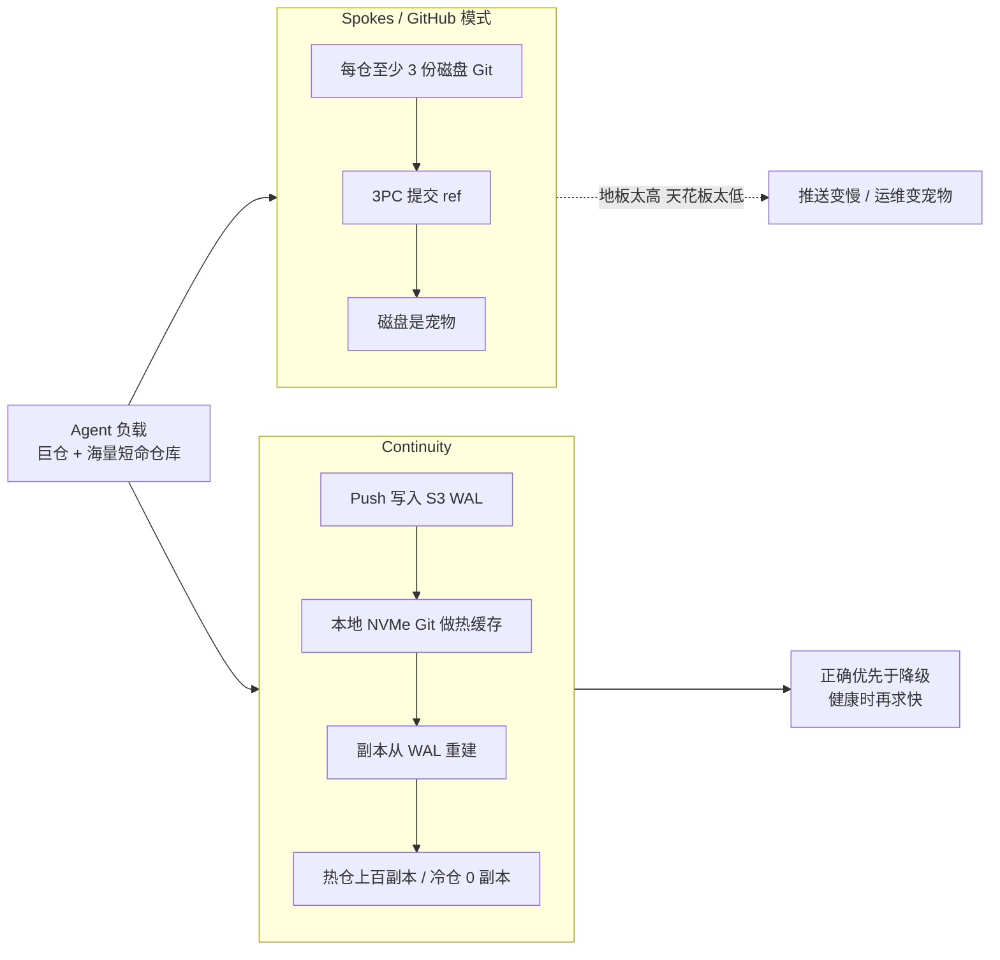

## 一句话结论

Cursor 认为 **Git 协议可以继续用，Git 托管的存储假设必须换掉**。Agent 同时制造了两种极端负载——超大 monorepo 的海量只读副本，以及海量用完即走的小仓库——GitHub 式「磁盘即真理、三副本 3PC」两边都撑不住。Continuity 的答案是：本地 NVMe 上的原生 Git 只是热缓存，S3 WAL 才是真理，副本按流量弹性伸缩。

## 一张图看懂

## 核心观点

### 1. Git 是为分布式内核工作流发明的，但今天几乎所有人都依赖中心主机

Vicent Martí（前 GitHub / libgit2，现 Cursor）把故事从 Linus 写起：Git 是给 Linux 内核这种高度去中心化项目准备的 BitKeeper 替代品，早期口号甚至是 “the information manager from hell”。

二十年后 Git 成了默认，但开源和公司团队实际上都靠一个中心 host。分布式模型仍有价值（离线、延迟 push），**难的是把这个 host 跑好**。

开篇第一句就是判断：

> Hosting Git repositories at scale is a nightmare.

原因很硬：每一份 Git 拷贝都是对等的，服务器上的仓库并不比笔记本上的特殊。表面上给磁盘加个 HTTP 前端就够了，但 packfile——既是压缩对象格式，也是网络传输单元——并不适合当服务器存储。线上你还得收发 packfile；机房里面，存储完全可以换成别的东西。

Linus 不会过来检查你服务器怎么存。**协议要兼容 Git，存储不必忠于 Git 的磁盘假设。**

### 2. 扩容只有三条路，从易到难：摊文件系统、摊 packfile、摊 Git 本身

对象级分布式看起来很诱人：Git 是内容寻址，SHA-1 当 key，像分布式 KV。实践里仓库是 DAG。列近期历史必须走 commit → tree → blob → parent。下一跳指针要等上一跳取回来才知道，远程往返会爆炸。

Shawn Pearce 在 Google/JGit 上的 DHT 实验已经证明：普通操作还行，clone 会死——因为协议仍然要求网络上给 packfile。

所以「把 Git 拆成 KV」这条路基本失败了。行业真正走通的，是后面两条里更保守的那条：保留原生 Git，只在 packfile / 复制层做文章。

### 3. GitHub 用了十年证明：网络文件系统搞不定 Git

GitHub 2008 年的口号是 “Git repository hosting: no longer a pain in the ass.” 早期就是一台机器上的 Rails + 本地仓库。Rails 可以水平加副本，磁盘上的 Git 跟不上。

他们试过 NFS、块复制（GFS、DRBD）。Git 假定的是本地磁盘的锁、撕裂和 sync 语义。packfile 为了体积会把对象打散：delta、和 DAG 相关性很低，逻辑上一跳、物理上随机跳。网络文件系统除非把整文件缓存下来，否则会爬——多租户大海量下这不可能。

最终 GitHub 放弃分布式文件系统，仓库放到专用 fileserver，用 RPC 说话。这解决了应用层水平扩展，**没有解决可用性，也没有解决热仓库性能**：每个仓库仍然活在一台机器上。

### 4. Spokes 是行业最优解，但 2026 年被 Agent 负载撕开了

大约 2013 年出现的 Spokes，Martí 至今认为有三条选择仍然正确：

1. 在 packfile 层操作，不要重写 Git
2. 把真正的 Git 仓库放在本地 NVMe 上
3. 复制时保持强一致

NVMe 本地 Git 让随机 pack 遍历仍然快，clone 走原生协议，也不用维护 Git fork。最终一致很差：push 完立刻 fetch 不到，客户端和 CI 都会乱。

Spokes 用三阶段提交：packfile 可以先扇出、不必共识；然后用 3PC 提交更小的 ref 事务（分支更新），多数派必须接受。Git 能锁 ref、检查期望值，再 commit 或 abort。之后任意副本都能服务读。

**2026 年暴露的三条裂缝：**

- **3PC 尾延迟。** 三副本曾经够用。企业 monorepo 和 CI 需要更多拷贝，但 3PC 被最慢那个节点卡住，副本越多 push 越慢。
- **小仓库浪费。** Agent 会制造海量短命仓库。三份闲置副本地板太高；少副本又怕一致性和丢数据。
- **运维养宠物。** 磁盘仓库是共识真理，每一份都很珍贵。需要路由库、持续 checksum、快速修复。三份里坏两份就没有 quorum，也不能 push。

Martí 的原话：

> You have to treat repositories as pets, not cattle.

这是整篇文章的情绪核：旧托管把仓库当宠物；agent 时代必须把仓库当牲畜。

### 5. Continuity：留下 Spokes 做对的，丢掉「3PC 即真理」

Continuity 保留：原生 Git on NVMe、packfile 层工作、强一致。丢掉：磁盘 quorum 当真相。

**WAL 在对象存储上。** 真理是 S3 兼容存储上的 write-ahead log（生产用 S3，设计上任意云）。一次 push 就是一个 WAL 对象。磁盘写入和 S3 上传一起发生。

> We never acknowledge a push until it has been fully persisted.

可见性还要等：本地 ref 事务成功，并且 WAL index 对象里记下指针。

> This forces all pushes to be linearizable.

忙仓库会把 S3 写入打批，PUT 延迟不再是硬上限。共识对着一份本地仓库，而不是副本 quorum，所以 ingest 可以跟着磁盘走。

**路由和「共识」。** 仓库是热缓存。位置可以在任何地方；缺的拷贝从 WAL 重建。Rendezvous hashing 把 repo ID 映射到更偏好的健康节点，但拓扑过期没关系——下一个节点会物化这份仓库。任意节点都可以收 push；S3 compare-and-swap 串行化 WAL 更新。哈希最前的节点当 preferred primary，只是为了减少 CAS 重试；发布和故障切换时，正确性不依赖谁是 primary。

> The system is designed to always be correct when degraded, and always fast when healthy.

**复制。** 副本数量没有上限，因为拷贝从 S3 追。乐观 UDP gossip 传元数据，丢包是预期。每个副本记住 WAL-index 的 ETag。读时做条件 S3 GET：304（约 <10ms 元数据）就本地服务；200 就先应用新 index。即使 gossip 丢了或路由错了，读仍然一致。

两个方向都能伸缩：

- 热 monorepo 可以有上百副本给 CI
- agent 用完即弃的短命仓库可以只有一份
- 闲置拷贝可以 GC，下次 fetch 再重建
- 持久化不需要额外副本，因为 S3 拿着真理

**压缩。** WAL 回放成本和 Git pack 膨胀都需要 compaction。Spokes 必须在每个副本上 repack（CPU 重，还有 failover 风险）。Continuity 只在 primary 上 compact，压好的 pack 作为 WAL 事件；副本从 S3 下载（用带宽换 CPU）。

他们刻意不用 Azure DevOps 那条路（pack 进 blob、ref 进 SQL）：拒绝把 Git 一致性拆到外部数据库。完整 WAL 历史还能给 push / repack 做 provenance，让副本快进或回退，Git 自己出 bug 时也能恢复。操作层始终是普通磁盘 Git。

### 6. 数字：读线性扩展，写受 Git 自己的压缩限制

合成压测，对象是 Cursor 自己的 monorepo `everysphere`：

- 读线性扩到 100 副本，push 不回退
- S3 Standard：压缩和副本追赶同时进行时，大约 120 pushes/s
- S3 Express One Zone：>300 pushes/s，然后卡在 Git 磁盘压缩
- 所有被确认的 push 都是线性一致、外部持久化的；clone 完全一致

这不是 SLA 承诺，是「这种架构在物理上走得通」的证据。瓶颈从「复制协议」挪到了「Git 自己的 on-disk 工作」。

### 7. Agent 是迫使他们重做托管的那个负载，不只是营销词

文章里 agent 出现的方式很具体，不是「AI 写代码所以我们要做 GitHub」：

- 企业平均仓库已经是巨大 monorepo
- Agent 经常在 monorepo 外创建海量小仓库，很多是 throwaway，大多数几乎不被碰
- 更多代码、更多 PR、更多 CI
- CI 不能接受最终一致：一百个 runner 里有三个找不到需要的 commit，就是失败
- 3PC 的副本地板对 throwaway 太高，天花板对 CI 太低

所以 Continuity 的弹性副本不是锦上添花，而是 **唯一能同时服务两种分布的形状**。

### 8. Origin 是产品，Continuity 是底下那层存储哲学

Origin 是 Cursor 的 Git 托管，2026-08-17 起在付费计划早鸟 beta。当时的产品还很克制：

- 仓库、PR、浏览/搜索、GitHub 同步是基本盘
- GitHub 导入仓仍以 GitHub 为真理，push 继续去 GitHub；以后可以 Detach
- Agent-native 功能明确说「很快」，不是第一天的卖点
- 没有免费层、没有公开仓、Issues/Actions 还不齐

Martí 把 Origin 说成多年做这些系统的人拿出来的生产哲学，不是实验室 demo。VCS 宕机代价极高，也很难隔夜替换，所以他们要低摩擦迁出旧主机。

底层信念很统一：**继续给世界原生 Git；对内把宠物变成牲畜。**

## 核心脉络

1. Git 协议按分布式、对等拷贝设计，中心化托管从第一天就不自然
2. 对象级拆分失败，文件系统级拆分失败，行业收敛到「本地 NVMe Git + 应用层复制」
3. Spokes / 3PC 在人类规模的仓库数量下是最优，在 agent 规模下地板太高、天花板太低
4. 把真理从磁盘 quorum 挪到对象存储 WAL，磁盘 Git 降级成可丢可重建的缓存
5. 副本数量跟流量走：巨仓上百份，短命仓库一份，闲置零份
6. 对外仍是普通 Git，对内才是新基础设施——这才能低摩擦替换

## 对实际工作的启发

### 对还在用 GitHub 的团队

- 今天痛的往往不是「Git 不够用」，而是「host 把仓库当宠物」：热仓 push 慢、副本不够、故障修复像救猫
- Agent 一上量，小仓库和 CI clone 会先打爆旧假设，然后才轮到「模型聪不聪明」
- 迁移主机的摩擦来自生态（PR、Actions、权限、习惯），不是来自 `git push` 本身。Origin 先做 GitHub 镜像，就是承认这一点

### 对自建 Git 基础设施的人

- 不要从「重写 Git」开始。Martí 反复强调：weird stuff with Git 会把所有精力吃掉
- 强一致不能丢。Agent 和 CI 比人类更不能容忍「push 了但有的节点还看不见」
- 对象存储当 WAL、本地 Git 当缓存，是 2026 年看起来最干净的拆分
- 压缩、repair、routing 这些运维税，来自「磁盘即真理」；换掉这个假设，税会少很多

### 和本库其他笔记的关系

- [[Harness Engineering：当工程师不再写代码]] 把仓库当成 Agent 的系统记录。这篇文章回答的是下一层：当 Agent 把仓库数量和 clone 频率推到另一个数量级，记录系统自己怎么活
- [[Zed：Introducing Delta]] 处理 commit 之间的语义；本文处理 commit 之上的物理复制。一个改工作协议，一个改托管协议
- [[Anthropic：The AI-native SDLC playbook]] 让生命周期按机器速度循环；本文让仓库按机器流量复制。一边是控制面能转，一边是数据面能扛
- [[Warp：How Warp builds self-improving agents on Claude]] 的进化产物是小而勤的 skill PR——另一种 agent 流量，host 同样要扛
- 合读判断见 [[Agent-native 软件基础设施与工作流]]

## 我认为最值得记住的三句话

- **Hosting Git repositories at scale is a nightmare.**
- **You have to treat repositories as pets, not cattle.**
- **Always correct when degraded, always fast when healthy.**

## 原文标记

- 原文标题：Git at any scale
- 作者：Vicent Martí
- 日期：2026-08-18
- 约 27 分钟长文，主体是二十年 Git 托管史 + Continuity 设计，Origin 只在文末作为产品出口
- 产品对照：[Origin changelog](https://cursor.com/changelog/origin-code-hosting)（2026-08-17）——当天早鸟 beta，GitHub 仍可当真理，agent-native 功能明确「稍后」
- 定位：不 fork Git，不引入外部 DB 拆一致性；S3 WAL 为源，NVMe Git 为缓存
