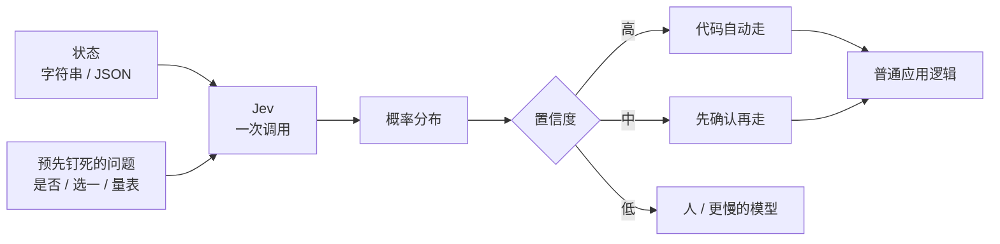

## 一句话结论

Flavio 把 TypeSafe 的 Jev 读成 **软件里的聪明 `if`，不是聊天模型的小号**。你给它一份状态和一组事先钉死形状的问题，它并行吐出带概率的答案，然后停；写回复、改仓库、跑工具循环，仍然是普通代码或另一台生成模型的事。改掉的假设是：每次「需要判断」都得请一台会说话的模型进场。

## 一张图看懂

## 核心观点

### 1. 产品不是对话，是软件内部的一次判断

TypeSafe 2026-09-15 出隐身，Jev 是第一款公开的 **System One** 模型。它不生成回复、解释或代码。一次请求是：状态 + 若干类型化问题；一次响应是：每个问题一个答案，外加概率。公司口径大约 100 毫秒、输入 $0.042 / 百万 token、输出免费。

Flavio 的压缩句是 **smart `if`**。`if (order.total > 100)` 能写，是因为条件能算。支持信是不是在发火、这封邮件是不是账单、结账该点哪颗按钮，代码算不出。以前三条路：手写规则、为每套标签训一个分类器、拿通用 LLM 要结构化输出。Jev 走中间：像 LLM 那样吃非结构化文本和运行时才定的问题，像分类器那样吐约束过的分布。

赞助表单那个例子把形状钉死：状态里是机会类型、产品名、描述；问题是「描述是不是在要赞助」（是否）、类别 `dev_tool | course | unrelated`（选一）、请求有多具体（量表）。返回里没有散文。代码用阈值：是否 > 0.9 且类别是 `dev_tool` 就发价目表，否则进人工队列。

否定的旧假设：AI 进产品，等于产品变成聊天窗口或 agent。

### 2. 和 ChatGPT / Cursor / Claude Code 差在循环停在哪

ChatGPT 吃 prompt，吐生成文本。Cursor 吃编码任务、仓库和工具，吐编辑、命令、测试。Codex / Claude Code 吃目标，自己选工具、改文件、跑命令、再试。Jev 不接开放目标，不看仓库，不调工具，不保有一轮 agent 循环。你的代码给一份状态和问题，它给类型化答案，然后停。

它可以坐在那些工具**里面**。编码 agent 可以先问这条 shell 是只读、可逆还是破坏性；路由器可以先问该把任务交给哪台模型；SaaS 可以先问这封支持信要查库、要生成模型、还是要人。一次用户动作可以触发好几次看不见的判断，界面上没有任何 AI。

Flavio 的赌注顺着杰文斯悖论（Jevons paradox）走：蒸汽机更省煤，用煤反而更多，因为便宜的动力会找出新用途。决策如果远低于一分钱，你会把它放到从来不会去调 LLM 的地方。一个人一天打开几次 ChatGPT；软件可以在后台做几千次小判断。公司把模型命名为 Jev，就是在买这条曲线。

「System One」借 Kahneman《思考，快与慢》：快的直觉判断归 Jev，慢的推理由推理模型做。生成模型即使被 JSON schema 卡住，仍然在逐 token 生成；schema 能校验，不能保证校准过的概率，失败和提前截断仍然发生。TypeSafe 说 Jev 对所有答案并行采样，每个问题对着同一份状态独立评估。成功响应里不可能出现 schema 外的值——形状是结构保证，对不对是另一回事。

公司自己的工作流评测写出「193.6 倍快、444.6 倍便宜」。Flavio 标成上限，不是典型值。端到端延迟他们写 70–500 毫秒，对照同类问题上前沿 LLM 的 3–329 秒。训练方法叫 **Reinforcement Learning for Calibrated Decisions（RLCD）**：90% 概率的那一批，长期看应该对大约 90%。这不保证单次。

### 3. 三种问题形状，加上置信度当闸门

每个问题有你起的 id（给代码用，不进模型）、类型、说明。选一和量表必须有标准；是否可以有可选标准。id 看起来再明显，说明里也要把问题写全。

| 类型 | 问什么 | 回来什么 |
|---|---|---|
| **Noul**（是否） | 高分必须等于「是」 | `noul`：0–1 的「是」概率。靠近 0.5 不是「中等」，是分不清。程度用量表 |
| **Choice**（选一） | 从你给的清单里挑 | 最高概率项 + 全部分布 + 置信度。清单可能盖不住时，文档建议留 `other` / `none_of_the_above` |
| **Score**（量表） | 在你排好的档位上落点 | 概率加权均值（可以落在两档之间）+ 图例 + 分布 + 置信度。每档写情境，不要写「高 / 中 / 低」这种程度词 |

状态是问题所问的内容：纯字符串、带字段的对象、或数组（对话、记录）。对象里可以用反引号路径指字段（`order.charges`）。只送问题需要的；不相干内容会掉准确度（他们叫 context rot），先在代码里滤。

选一和量表带 0–1 的置信度，来自分布的形状。文档给的是例子不是默认：0.5 当复查地板，破坏性动作之前 0.9。Flavio 转的模式：高 → 自动走；中 → 带着确认走；低 → 不走，交给人或更慢的系统。错一次的代价决定阈值，用你自己的标注数据画置信度对准确度，再挪。

大小：状态加全部问题大约 6.4 万 token；状态加最长那一问大约 3.2 万 token。选一最多 255 项，量表 2–10 档。只读文本。当时模型是 `jev-1.13.0`；别名 `jev-latest` / `jev-preview`。对某一版调过阈值，就钉版本号，别钉别名。

### 4. 一次问完所有独立问题，组合发生在代码里

编码 agent 常把 LLM 习惯带过来：先问一个，再决定下一个。Jev 每个问题对着同一份状态并行跑，多一问只多那一问的 token。TypeSafe 把「把可能用到的独立问题一次问完」叫做 **speculative fan-out**。一份 cookbook：13 问打成一批，比 13 次串行便宜 12.2 倍、快 10 倍（`jev-1.12`，53,777 字符的文档）；大头是长状态只送一次。并发的多次独立调用能缩小延迟差，省不掉重复的输入费。答案之间没有批处理效应，超出采样噪声。

第二次请求只在代码**必须先拿到第一答**才能构造时才出现：要去另取数据，或第一答决定下一问的选项。例：先给 182 个 skill 排序，再对前三的全文问第二轮。第二轮本来就能对着原状态问的，第一轮就该问。

组合不要写成一个大问题。票优先级拆成严重度、沮丧、报告质量三张量表，按各自顶档归一（0–2 和 0–3 不能直接加），再 0.6 / 0.3 / 0.1 加权。改系数，不要改 prompt。意图路由也是同一形状：查订单走数据库、不问 LLM；产品问题走带产品上下文的 LLM；投诉看 `needs_reasoning` 是否过线再决定人还是模型。

写问题时：一问一个判断；范围词、否定、隐含条件按字面读。标准里写情境，邻档分不清时给带相同字段名的例子。Safari 导出缺陷那条：纯字符串档位落到 1.30、置信度 0.54；补一条相关例子变成 1.07、0.90。无关例子几乎不动。缺出口就加 `other` 或「未说明」。数字、日期、计数留在代码。问题和阈值放同一个文件。阈值信之前，先拿标注例子打。

### 5. 锯齿在字面、算术和「让它写」

`jev-1.13` 的 jaggedness 很具体，不是「模型还不成熟」那种空话：

- 字面读。不写清就拆成两问。
- 不是计算器。字符数、词频、列表项数不可靠。叫得出颜色名，比不出两个十六进制色近不近。语义计数：对每一项问一次是否，在代码里加总。
- 量表不是测量。1.4 不要当幅度去插值；拿它过阈值或排序。
- 日期当文本读。顺序、距离、窗口不可靠。抽成月/日/年的选一（加「未说明」），真日期比较放代码。
- 双重否定、属性的属性，掉准确度。不相干的大状态也掉；先滤，或按块问是否相关。
- 类型化输出不保证路由对。模型、问题、标准、阈值要一起版本化；改任何一块，拿代表输入重放。
- 状态被当成数据，但诱导文字能搬答案。现在要靠更紧的标准和敌对输入测试。
- 说明和标准打架（是否题里 true 表示「否」），答案变差。
- **它不能写。** 用选一去拼字符又慢又差。要抽一个值：用正则或 LLM 找出候选，让 Jev 挑。Flavio 的规则：从牌堆里抽一张，不要让它报牌名。

早期实验（不是生产案例）用来说明原语有多宽：1018 篇论文摘要打 24 个主题 $0.08、中位 256 毫秒/篇，LLM 摘要另花 $3.99；9.8 万条 listing 十分钟；简历筛选大约小 LLM 的十分之一。实时编辑器在停键时打语气、确信、紧迫、「读起来像 AI」；浏览器扩展按用户类别藏怒点、加密推销、政治吵架。游戏 demo 把 Doom 打到大约 10 问/秒、$7/小时。规划仍用 LLM、点哪个页面元素交给 Jev 的订机票 demo 大约七秒。自然语言 SQL 不让它生成任意语句：给允许的模板和列，它选意图和选项，代码拼参数化查询。

Flavio 自己的刹车：有用的指标是**每个解决掉的任务多少钱**，不是每 token。重试和人工复查会吃掉节省。用例清单最后会塌成两三个真正有流量的集成。确定性代码已经能判的，继续用代码。演示不证明哪条能赚钱、扛流量、或换模型之后还准。

### 6. 他自己准备怎么用：影子模式，先改排序，再交控制权

他有控制台权限，还没放进生产。计划从每天已经在做的决定开始，影子跑，对过再交权。

编码 agent 开工前先路由：选一 `deterministic_script | fast_agent | reasoning_agent | browser_agent | human`，再加一张模糊度量表、一个「要不要登录态应用」的是否。Jev 不启动 agent，代码按阈值启动。Shell 前先做安全：只读 / 可逆 / 不可逆，外加是否删文件、改 Git 历史、部署、摸仓库外。先记日志；以后高置信只读可以自动续。

他那 2000+ 篇博文的维护，Jev 是错工具去比版本号。该问的是：这段是不是版本声明、价格/限额、可能改过的产品界面、需要对照当前文档的主张。代码把这些段落收起来，再交给 agent 或脚本去核。赞助问询：是否真赞助、产品类别、具体程度——先把答案附到现有邮件上，稍后才准备回复、仍不自动发送。

Events Logger 是他眼里第一个配进生产的测试：严重度量表 + 是否用户可见失败 / 是否丢钱 / 是否要动作。时间序信息流保留，第二视图按语义优先级排。答错了只是仪表盘换了序。

每个工作流同一套上线法：现有行为不动；旁边跑、记下完整答案；标对错；改问题和阈值；先自动化低风险路径；不确定的留给人或更强模型。不要拿它写、改写、摘要、精确算术、看图。

访问：typesafe.ai 等候名单，或 Vercel AI Gateway 的 `typesafe-ai/jev`（价相同，走 AI SDK）。直接 SDK 挡住浏览器，免得密钥出网。编码 agent 集成之前先装 TypeSafe 的 skill——agent 受过 LLM API 训练，会一次只问一问、还会发明请求字段。

## 核心脉络

1. 判断可以是软件原语，不必是一段生成出来的话
2. 形状（是否 / 选一 / 量表）事先钉死，概率和置信度是正常输出，不是事后从散文里救
3. 一次问完所有独立问题，组合、阈值、加权发生在你能改的代码里
4. 它换来的是快和便宜；写、算、看图、编日期，仍然不是它的活
5. 上线路径是影子、标注、再交低风险分支，不是把产品改成「Jev 应用」

## 对实际工作的启发

### 对还在用 LLM 做分类和路由的人

- 先量分类 / 路由 / 打分 / 核验占账单多少。Flavio 的算术：月 $10,000 的 AI 里若 $6,000 是分类、新路径是旧成本的 5%，能省约 57%；分类只占 10%，就不可能砍掉总账单的 60%
- 论文那组数字最能提醒管道成本：分类 $0.08，摘要 $3.99。省在判断上，生成一步仍按生成价付
- 问题和阈值放同一个文件。改 prompt 散落在各处，阈值无法重放

### 对编码 agent / harness

- 破坏性 shell 前面放一道只读 / 可逆 / 不可逆，比把「小心 rm」写进 `CLAUDE.md` 硬。影子测试里，含糊的 `rm -rf` 回来「不可逆」0.56、置信度 0.33——该问人，不该自动续
- 这和 [[06-MattPocockSkills/09-评审与落地]] 的向导是同一类拆法：人才能做的步骤不要留在 agent 循环里。Jev 把「机器能做、但必须带概率闸」的那一截也拆出来
- 一次问完，不要一次一问。这和 grilling 的「一轮问完整条前沿」是同一判断，用在机器对机器

### 和本库其他笔记的关系

- [[用好AI的第一步：停止和AI聊天]] 说聊天窗口是最低形态，要把 AI 放进有反馈的执行系统。Jev 是更狠的一刀：有些判断根本不该进聊天，也不该进 agent 循环，只该是函数返回值
- [[Anthropic：The AI-native SDLC playbook]] 的闸门是人接受工件。Jev 的闸门是置信度阈值。一边问「这份规格能不能进下一阶段」，一边问「这次判断能不能自动走」
- [[Warp：How Warp builds self-improving agents on Claude]] 把日常对错沉淀进 skill。Jev 把日常对错沉淀进阈值和标准——改系数，不改散文
- [[05-ClaudeCookbooks/07-Skills]] 讲 skill 是按需展开的程序性知识。TypeSafe 给编码 agent 的 skill，专门用来阻止「按 LLM 习惯一次问一问」
- 不要拿它去替代 [[03-HarnessEngineering/Book1-ClaudeCode/00-序言]] 里的运行时制度。它不跑工具循环

## 我认为最值得记住的三句话

- **A smart `if`.**
- **Pick a card from the deck; do not ask it to name a card.**
- **Ask every independent question in one call.**

## 原文标记

- 原文标题：A deep dive into Jev, TypeSafe's System One model
- 作者：Flavio Copes
- 更新日期：2026-09-18
- 来源：作者读过控制台、SDK 和 cookbook 之后的机制长文，不是 TypeSafe 新闻稿改写；文末写明自己还没放进生产
- 产品锚点：Jev / System One；`jev-1.13.0`；API `https://api.typesafe.ai/v1/systemone`；Vercel AI Gateway `typesafe-ai/jev`
- 公司口径对照：[typesafe.ai](https://typesafe.ai)（「Decisions, not strings」；RLCD；$42 / 十亿输入 token）
- 定位：把「需要判断」从生成循环里拆成可组合的类型化调用；生成模型只在真要写字时出场
