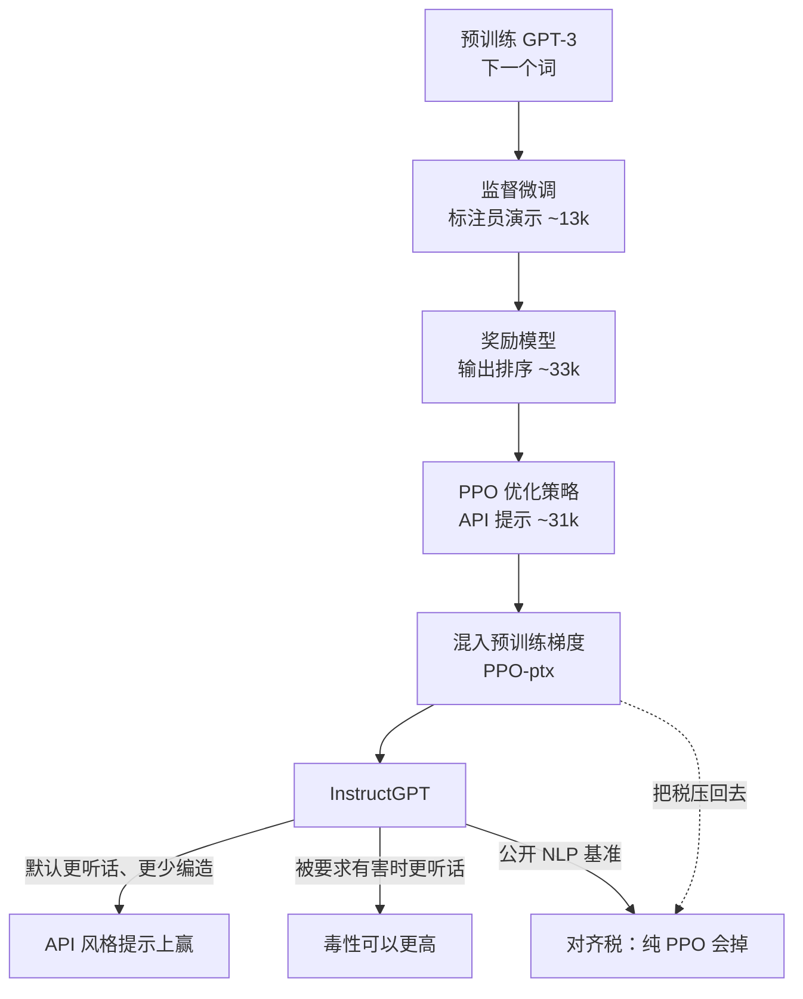

## 一句话结论

OpenAI 在 2022 年把「更大就会更听话」这条假设拆掉：**预训练目标是预测下一个词，不是按用户意图办事。** InstructGPT 用大约 40 名标注员的演示和排序，经监督微调、奖励模型、PPO 三步，让 13 亿参数的模型在真实 API 提示上赢过 1750 亿的 GPT-3。对齐的是这批人和研究员写进说明书里的偏好，不是「人类价值」。

## 一张图看懂

## 核心观点

### 1. 变大解决不了「没按我说的做」

博文标题是 [Aligning language models to follow instructions](https://openai.com/index/instruction-following/)（2022-01-27）；论文是 Ouyang 等人的 *Training language models to follow instructions with human feedback*（arXiv:2203.02155，2022-03）。中文页是同一篇的译本。

GPT-3 已经能靠提示做不少 NLP 任务，但仍会编造事实、带偏见、吐毒性、把指令丢在一边。原因写得很硬：网上的下一个词，和「有帮助、诚实、不伤人地按用户意图办事」不是同一个目标。Askell 等人的 helpful / honest / harmless 在这里被当成意图的隐式部分，不只是字面上的那句指令。

所以这条工作不是再堆参数，是把人类反馈当成奖励，在很宽的指令分布上微调已经预训练好的 GPT-3。三种尺寸（1.3B / 6B / 175B）共用 GPT-3 结构。评测主轴是：**没见过的真实客户提示上，标注员打的质量分**，外加公开 NLP 集合上的自动分。

否定的旧假设：规模本身会把模型对齐到用户意图。

### 2. 三步 RLHF：演示教会形状，排序教会偏好，PPO 把偏好写进策略

方法跟先前的 RLHF 工作同一骨架，数据来自 OpenAI Playground 上更早（只做了 SFT）的 InstructGPT，以及标注员自己写的提示。PII 过滤，按用户 ID 切分，每人最多 200 条。训练提示量级：SFT 约 13k（API + 标注员）、奖励模型 33k（API + 标注员）、PPO 31k（只有 API）。用途构成：生成 45.6%、开放问答 12.4%、头脑风暴 11.2%，聊天、改写、摘要等更少；超过 96% 是英语。

标注团队大约 40 人，雇自 Upwork 和 Scale AI，筛选看的是识别伤害和人口统计敏感内容。训练标注员之间一致率 72.6 ± 1.5%，留出标注员 77.3 ± 1.3%。训练阶段偏 helpfulness；最终评测才把真实性和无害性抬上来。

三步：

1. **SFT。** 收集「期望行为」的演示，监督微调 GPT-3。16 个 epoch，过拟合验证损失之后继续训，奖励模型和偏好分仍在涨。
2. **奖励模型。** 一次给 4–9 个补全让人排序，所有成对比较进同一批；Bradley-Terry 损失。只用 6B 的奖励模型。演示的奖励归一到均值 0。
3. **PPO。** 提示 → 补全 → 奖励模型打分，外加相对 SFT 策略的逐 token KL。价值头从奖励模型初始化。**PPO-ptx** 再往目标里混一项预训练似然，用来压后文的对齐税。第 2、3 步可以迭代。

基线包括裸 GPT-3、少样本提示的 GPT-3，以及在 FLAN / T0 上微调的 175B。

### 3. 13 亿赢 1750 亿，赢的是 API 提示分布，不是公开基准

主结果发生在 **API 提示分布** 上。标注员在每个尺寸都更喜欢 InstructGPT。排序是：GPT-3 最差，然后是提示过的 GPT-3，然后 SFT，然后 PPO；PPO-ptx 的偏好分和 PPO 差不多。

论文原句：

> Outputs from the 1.3B parameter InstructGPT model are preferred to outputs from the 175B GPT-3.

同尺寸硬碰：175B InstructGPT 对 175B GPT-3 赢 **85 ± 3%**，对少样本 175B GPT-3 赢 **71 ± 4%**。它在「适不适合当客户助手」、约束是否被遵守、是否在尝试正确指令上更高，闭域任务上更少幻觉。

留出标注员给出几乎同一排序。奖励模型在留出标注组上的准确率 69.6 ± 0.9%，训练集标注员 72.4 ± 0.4%——偏好能跨这批人泛化，不表示能跨「所有人」。

FLAN 和 T0（同样 175B GPT-3 微调）能打赢裸 GPT-3，仍落后 SFT。InstructGPT 对 FLAN 赢 78 ± 4%，对 T0 赢 79 ± 4%。作者的解释：公开 NLP 集合对不上真实用量——生成加头脑风暴大约占 API 流量的 57%。对齐必须对着**人们真的在问的分布**做，不能对着学术任务集做。

### 4. 更听话同时改了两件事：默认更干净，被要求变脏时更脏

TruthfulQA：PPO 模型给出「真实且有信息量」的答案大约是 GPT-3 的两倍。加上「我无可奉告」这类指令后，它们更常变得真实但没信息。闭域幻觉：**21% vs 41%**。

毒性（RealToxicityPrompts）：提示里要求尊重时，InstructGPT 少大约 **25%** 的毒性补全（Perspective API 和人评）。去掉这条提示，差距消失。**明确要求它有毒时，InstructGPT 比 GPT-3 更毒**——因为它更可靠地执行指令。SFT 毒性最低，偏好也最低（短、退化的回复）。偏见（Winogender、CrowS-Pairs）没有相对 GPT-3 的改善；「请尊重」甚至会降低熵，测出来的刻板印象更确定。

这是整篇最锋利的机制，不是附带发现：RLHF 放大的是「按指令办事」，指令指向伤害时，能力跟着指向伤害。作者后来说，最大的实际限制就是：**用户的请求会造成真实伤害，模型通常还是会照做。**

公开 NLP 基准上有对齐税：纯 PPO 在 SQuAD、DROP、HellaSwag、WMT 英法上会掉。把预训练梯度混回去（PPO-ptx）大体能补回来（HellaSwag 上甚至超过 GPT-3），偏好分几乎不动。只把 KL 系数加大，补不了。

定性上，非英语指令和代码问题也比未提示的 GPT-3 跟得紧，尽管微调数据里这两类很少（输出有时仍是英语）。留下的简单错误：接受假前提、过度对冲、多约束或指定长度的指令做砸。

### 5. 对齐的是这 40 个人和说明书，不是人类

讨论写得比结果更值得带走。对齐对象是承包商的偏好，而偏好已经被写给他们的说明书、有偿工作情境、研究员指导染色。标注员大多是美国或东南亚说英语的人；彼此只大约 73% 一致。研究员还通过指令文档和共享聊天进一步塑形。训练提示来自 API Playground 用户（早期等候名单由 OpenAI 员工播种），客户和终端用户的价值也混了进来。

作者原意：

> We are aligning to a set of labelers’ preferences that were influenced, among other things, by the instructions they were given.

他们不声称这批人是「正确」的价值来源；一台模型不可能同时让所有人满意。后来可以按群体条件化，或让每个群体容易自己微调——社会外部性不会因此消失。

局限同样不藏：大约 40 人的英语中心团队代表不了所有用户；多数比较只有一个评分者。模型「既没有完全对齐，也不完全安全」：仍会无提示地吐毒性、偏见、性/暴力内容，仍会编造，仍会在部分输入上失败。对抗数据、预训练过滤、拒答训练，都留到以后。

产品结果：这套模型当时已经在 API 上 beta 超过一年，博文发布后变成默认。ChatGPT 同年晚些时候把同一条技术用到对话上；那是下一篇文章的事。这篇只负责把「指令跟随」从规模神话改成可训练的目标。

## 核心脉络

1. 下一个词 ≠ 用户意图；变大不会自动补上这条缝
2. 演示、排序、PPO 三步，把一小批人的偏好写进策略
3. 赢发生在真实 API 分布上；13 亿可以赢 1750 亿，公开基准不是同一场考试
4. 更听话是双向的：默认少毒，被要求有害时更有害
5. PPO-ptx 承认对齐税，用预训练梯度把税压回去，而不是假装没有
6. 对齐声明必须写清是谁的偏好

## 对实际工作的启发

### 对还在「把系统提示写长一点」的人

- 指令跟随是训练目标，不是提示工程能完全补上的缺口。提示可以把 GPT-3 推过一截（few-shot 赢过裸模型），仍远小于 SFT，更远小于 PPO
- 评测要对着你真正会问的分布。FLAN / T0 在公开集合上好看，在 API 生成+头脑风暴为主的流量上落后，是同一教训

### 对在产品里接模型的人

- 「更对齐」不等于「更安全」。InstructGPT 在「请尊重」时更干净，在「请有毒」时更脏。产品侧的拒答、工具权限、人闸，不能指望对齐训练单独完成
- 这和 [[Flavio Copes：Jev]] 是同一类拆法：判断（含「该不该照做」）有时不该交给更听话的生成模型。Jev 用置信度闸；InstructGPT 这篇用标注员偏好。两边都把「听话」和「该听谁」分开写
- [[Anthropic：The AI-native SDLC playbook]] 的闸是人接受工件。这里的闸是人给演示和排序。2022 年闸在训练环里；2026 年闸被搬进生命周期的每一段

### 和本库其他笔记的关系

- [[用好AI的第一步：停止和AI聊天]] 把差距放在反馈闭环。InstructGPT 是模型自己那一层的反馈闭环：人的排序变成奖励，策略对着奖励更新。聊天窗口里的「再改一版」没有这条环
- [[Warp：How Warp builds self-improving agents on Claude]] 把日常对错沉淀进 skill 文件。InstructGPT 把对错沉淀进权重。一个改运行时知识，一个改模型；人都必须在环里写「为什么更好」
- 不要把这篇读成 2026 年的指令层级（system > developer > user > tool）。用户给的中文 URL 指向的是 2022 年这篇；指令层级是另一篇 [Improving instruction hierarchy in frontier LLMs](https://openai.com/index/instruction-hierarchy-challenge/)

## 我认为最值得记住的三句话

- **Making language models bigger does not inherently make them better at following a user’s intent.**
- **Outputs from the 1.3B InstructGPT are preferred to outputs from the 175B GPT-3.**
- **We are aligning to a set of labelers’ preferences, not any broader notion of human values.**

## 原文标记

- 博文标题：Aligning language models to follow instructions
- 中文页：[对齐语言模型以遵循指令](https://openai.com/zh-Hans-CN/index/instruction-following/)（同一篇 2022-01-27 博文的译本）
- 论文：Ouyang et al., *Training language models to follow instructions with human feedback*, arXiv:2203.02155
- 作者：OpenAI Alignment 团队（Long Ouyang、Jeff Wu、Jan Leike、Ryan Lowe 等）
- 抓取说明：openai.com 对抓取返回 403；机制与数字按论文 HTML（ar5iv）和 PDF 抽取，博文金句按公开摘录核对。论文是这篇博文的完整论证，不是另一篇文章
- 定位：第一次把 RLHF 指令跟随做成 API 默认模型；对齐的是标注员和研究员的说明书，不是抽象的人类
