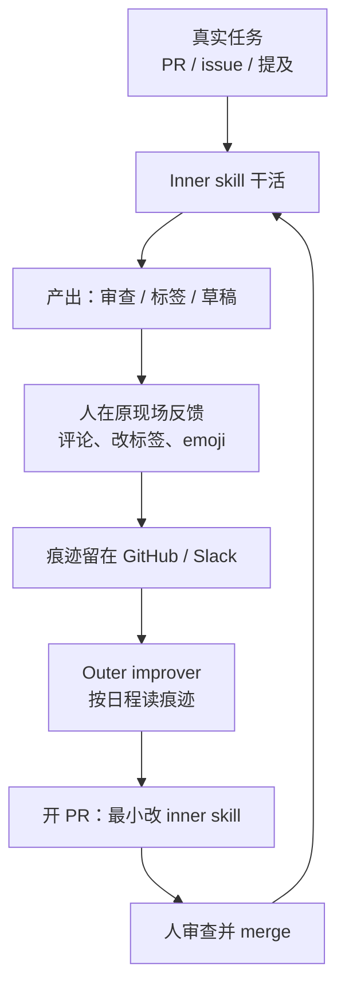

## 一句话结论

Warp 认为 **agent 变好靠的不是一次写对的 prompt，而是一条能把团队日常判断沉淀进 skill 文件的闭环。** 内圈 skill 干活，人在已经在用的 PR / issue / Slack 里给「是什么 + 为什么」，外圈 observer 按日程读这些反馈、开一个改 inner skill 的普通 PR；人合入之后，下一次内圈自动变好。

## 一张图看懂

## 核心观点

### 1. 第一版 80 分的 prompt 会制造「吵而且烦」的体验，手改 prompt 跟不上

[How Warp builds self-improving agents on Claude](https://claude.com/blog/how-warp-builds-self-improving-agents-on-claude)（Michael Segner，2026-08-26）是 Anthropic 创业系列里的 Warp 案例。Warp 是建在 Claude Platform 上的 AI terminal / agentic 开发环境：约 80 万月活开发者，Fortune 500 里 56%，Warp 内 Claude Code session 累计 1000 万（每周 40 万+），Agent 对话累计 4000 万。

他们先被内部 code-review agent 打脸：工程师觉得评论没用、质量差。第一版 prompt 大约 80% 对，体验却是 noisy and annoying。两条早期补丁都不规模：

- 看见失败就手改 prompt：能用一点，跟不上
- 往 `AGENTS.md` 里堆上下文：有帮助，不完整

更深的失败是：**对 agent 的反馈通常在 session 结束时消失**，下一次运行带不走这次学到的东西。

前置文把问题说得更白。[Agents Need Feedback Loops, Not Perfect Prompts](https://www.warp.dev/blog/agents-need-feedback-loops-not-perfect-prompts)（Petra Donka，2026-05-14）：写代码的 agent 可以对着测试、构建、命令输出重试；社区回复、外联、支持、审查评论、文档、招聘不行。你不能先发一批公开帖，等信任升了或降了再重来。信号慢、噪、贵。于是系统停在「几乎能用」：输出好到让人起期待，又没好到能信。人们就继续改 prompt，希望下一版补上缺口。

> Getting an agent to do the task once is not the hard part.

难的是做出一套系统，让 agent 从团队**已经在做的工作方式**里变好。起始 prompt 只是开始。

### 2. 架构就三件事：inner skill、人在中间、outer improver

Warp 用 [Agent Skills](https://platform.claude.com/docs/en/agents-and-tools/agent-skills/overview)——把知识写成文件，而不是塞进裸 prompt。agent 干活时查找，而不是把全部指令烫在 system prompt 里。

Zach Lloyd：

> File-based skills are a way of encoding knowledge for agents without putting that knowledge directly in the prompt, as something the agent can simply look up in the course of doing its job.

循环是两个 skill，人的反馈夹在中间。

**Inner / base skill。** 持有领域知识和指令，按任务跑。PR 打开时，code agent 拿着这条 skill 加上下文写审查。issue 新建时，triage agent 打标签、估复杂度、给方向。

**Human feedback。** 不可省。大拇指可以，**说明为什么更好。** Lloyd 的例子：人可以肯定「这条评论有用」；也可以解释审查为什么失败——比如一条 rename 建议违反了某类全局变量的命名约定——下次才能做对。质量优于数量，但数量仍有帮助：资深工程师几条带领域细节的意见，能压过大量 thumbs。二进制上/下不说 *why*。Warp 后来把循环铺到整个开源仓：数百贡献者、数千次审查。

低摩擦是条件。反馈必须落在人已经工作的地方（PR / issue 评论），自动捕获，不要额外提交步骤。

> Low friction is what keeps signal flowing.

给反馈很难，你就得不到；得不到，skill 就不会变好。

**Outer / improver skill。** 观察者 agent，**按日程跑，不按任务跑。** 它收集累积的人类反馈，比较 agent 建议和人实际怎么做，然后对 inner skill 提出**小而聚焦的编辑**。因为 skill 就是普通文件，agent 很会改它们。编辑可审查、可批准、可经普通 PR 合入。合入后，下一次 inner 运行继承这次改动。

> This simplicity is the beauty of this approach.

实现细节在 [How to build a self-improvement loop for your Skills](https://www.warp.dev/blog/self-improvement-loop-for-skills)（Zach Lloyd，2026-06-16）写得更硬：

- Inner：`.agents/skills/triage-issue/SKILL.md`，issue 创建时 GitHub Action 拉起 Oz 云 agent
- Outer：`.agents/skills/improve-triage-skill/SKILL.md`，每天跑一次，读所有已分类工单上的人工覆盖
- 痕迹存在文件、agent trace、或 Slack / GitHub 这类外部系统的一次交互里
- 信号可以是人，也可以是「有明确目标、不需要人」时的自动 grader
- 改进后的 skill **只有 diff 被 merge 之后**才进入下一次内圈

编排在 Warp 的云 agent 平台 **Oz**。同一套拆分不绑死 Warp：别的栈也能做 inner / outer。

### 3. 写 skill 的六条：原则，不是规则表

1. **写原则，不写规则。** 「像在指导一个聪明人，而不是在给计算机编程。」「找重复代码」比穷尽命名表更能泛化。Buzz 的反面教材：第一版是长 if-then 清单（bug、竞品对比、定价），变脆、听着像套话、遇见没见过的情况就失败。换成「有帮助，别防御」「别俯视用户」「事实主张去对文档」「听起来像做产品的人，不像处理反馈的人」之后，文件变短，泛化变好。
2. **解释为什么。** 理由让 agent 推理，而不是死跟指令，泛化才发生。
3. **让反馈不费劲。** 见上。现场就是日志，不要另做反馈产品。
4. **skill 保持小，用 progressive disclosure。** 好的 skill 文件不大；它指向资源文件和脚本，而不是一次把所有东西倒进上下文。triage 的 improver 把拉 issue 的 Python 脚本绑在 skill 里，而不是每次现写——这本身就是最佳实践。
5. **质量优于数量，数量仍有帮助。** 领域细节来自人，agent 否则没有途径得到。
6. **额外力气花在 improver 上。** 除开领域知识，这套机制可复用：code review 的 improver 和别的 agent 的 improver 没那么不同。领域重叠用模板底圈，上面再加领域权重。几个 improver 可以各管一个 agent；上百个 agent 就该共享。

还有一条写在 FAQ、却和前几篇笔记直接咬合的区分：

**不要把 skill 和 memory 混为一谈。** Skill 是程序性的、稳定的——「如何做 X」，与单次运行无关，故意改。Memory 是推理时自动写的，一直在变。Warp 改的是前者。静默改 memory 不是这条循环。

### 4. 工作实例：漏掉 `ready to spec`，现场评论，次日变成 skill PR

Demo：[warpdotdev/warp-agents-demo-github-issue-triage](https://github.com/warpdotdev/warp-agents-demo-github-issue-triage)

新 GitHub issue → Action 拉起 inner agent：打复杂度 / 可行性分、贴标签、给修复方向。inner skill 里是每个标签意味着什么，以及行动前如何研究代码库。

某次 inner 跑得不错，但漏了 `ready to spec`——意思是贡献者可以开始写产品和技规。维护者就在这条 issue 上评论，说明期望行为和原因。「是什么 + 为什么」这种形态，后面的 agent 很好吸收。

Outer improver 作为 Oz 里定时的 “update triage” agent 跑：向 GitHub 鉴权，跑 skill 自带的 Python 脚本拉近期带反馈的 issue，收成 JSON 再读回上下文。它找到维护者评论里的具体信号，提出能捕获这些信号的**最小编辑**，开 PR：当 issue 描述的是真实问题、即使 UI/UX 还没定义，也打上 `ready to spec`。

PR 写明看见了哪些信号、改了什么。人审、批、合。下一次 triage 继承。最后这道人类闸门，让人仍然控制「到底改了什么」。

Warp 现在把同一机制铺到自己的开源仓：spec-writing、review、triage，各有各的圈。抽出来的框架：[warpdotdev/oz-for-oss](https://github.com/warpdotdev/oz-for-oss)。

### 5. Buzz：判断类工作更需要这条圈，因为没有测试可以重试

社区 agent Buzz 每周面对一千多条提及，小团队手看不过来。它盯 Twitter / LinkedIn / Reddit / Bluesky，选择回复、点赞、记下或跳过；该回时把草稿打进 Slack。**对外回复仍是人写。** 赢的是人不必再盯所有表面、打开每条线程、决定什么重要、从空白框开始。

判断类工作不能对着测试重试。Warp 给 Buzz 加了一条「学会如何学习」的 skill：比较草稿、人的改写、当前指令，然后问「要达到期望输出，缺了或没写清哪条原则？」学习路径是：从一次具体打偏或打中出发 → 当症状问为什么 → 泛化出单次之外 → 锐化、增加或丢掉现有原则 → 写成如何思考，而不是做什么 → 放到正确章节 → 文件保持紧、合并重叠。

如果只记人的改写，Buzz 会把「太营销」收成「永远别在第一句提定价」，而不是可迁移的「如果对方在发泄，先共情，别先推销」。**教会 agent 如何学习，也逼着团队把原来只存在于口味里的东西写到纸上。**

日常圈嵌在已有工作里：Buzz 已经把提及打进 Slack，带建议和草稿。人用 emoji 表示自己实际做了什么，线程里可以补一句。一键就是信号。每天 Buzz 收集反应和备注，对比自己的判断和真实行动，抽出耐久教训，改 skill 文件，开 PR。

> The best way to get leverage from agents is not to turn everyone into prompt engineers.

而是设计工作流，让团队正常的判断和口味，变成周围系统的训练信号。结果：Buzz 每月处理数千条提及，大约一半不需要回复；大约 15 条 skills（分诊、起草、学习、分析、汇报）由 Oz 编排。编制不增，更多时间去到口味、关系和 Warp 对外该是什么感觉。

三条设计规则：

- Principles beat rules, because rules overfit and principles transfer.
- Agents need to learn how to learn, or feedback turns into brittle exceptions.
- The feedback loop has to live where the team already works, or people stop participating.

目标不是拿掉人类判断，是让它复利：

> I do not want to remove human judgement and taste from the system. I want to make them compound.

时间久了，系统会越来越不像「有人写过一次的 prompt」，而像「团队如何思考的工作记忆」。最好的团队不会只写更好的 prompt，他们会建更好的圈。

### 6. 反馈会错；所以 inner 可以自动跑，skill 的进化不能自动生效

FAQ 里几条几乎是给企业用的：

- **假设反馈会错。** 不要让 agent 盲目接受。给它 sanity-check 的上下文，过滤谁的输入算数，在过滤或最终审查时留人。
- **领域可验证？** 先建 verification harness，再让 agent 对着它调：生成参考语料，比输出和参考，修，重复。
- **不可验证？** 能对 golden output 做确定性 eval 的地方就做。必须靠人的地方，只问领域专家，不要开闸放水。
- **怎么知道在变好？** 盯人已经在看的指标——合入时间、贡献者数、成本——喂回 improver。部署用 crawl-walk-run。

这和 [[Anthropic：The AI-native SDLC playbook]] 的硬边界是同一类判断：写的身份不能批自己；检测保持确定性；人留在闸门上。Warp 把同一条用在 **skill 文件的进化** 上：inner 可以无人启动，outer 可以自己开 PR，**合入必须是人。** 指令如果驱动生产，「它们就该住在仓库里，有版本历史、审查和回滚。」

## 核心脉络

1. 一次性把 prompt 写到 80 分，会得到吵而且烦的 agent；缺口不在模型，在反馈随 session 蒸发
2. 判断类工作没有测试可以重试，更不能靠「再改一版 prompt」
3. 把领域知识写成文件（inner skill），把团队现场判断当成信号，把学习写成另一个文件（outer skill）
4. 学习的产物是对 inner skill 的普通 git diff，走普通 PR
5. 写原则和为什么，才能泛化；写规则表会过拟合，会把反馈收成脆的例外
6. 反馈必须落在人已经工作的地方，否则圈会停
7. skill 稳定、故意改；memory 一直变。不要混
8. 人合入之后，下一次内圈自动变好——判断开始复利，而不是每次从零教

## 对实际工作的启发

### 对已经在跑 agent、却不停手改 prompt 的人

- 先问：这次纠正会不会在 session 结束时消失？会的话，你没有圈，只有聊天
- 把「Claude 把同一个错犯两次就写进 `CLAUDE.md`」升级成：外圈 agent 提议补丁，人 merge。Anthropic 手册里那条工作规则，Warp 把它机械化了
- 不要另做反馈表。PR 改标签、Slack emoji、issue 评论就是日志

### 对平台 / 开源维护

- inner 按事件触发（新 issue、新 PR），outer 按日程跑（每天看所有覆盖）
- skill 当代码：审查、回滚、归属。静默自改生产指令，是在放弃控制
- improver 值得单独打磨，因为它跨 agent 可复用；领域知识留在 inner

### 对判断类、品牌类、支持类工作

- 没有测试的领域更需要这条圈，不是更不需要
- 先写原则，再教「如何从一次打偏里抽出原则」
- 对外行动仍可由人做；agent 负责盯表面、起草、学习。编制不必先加人

### 和本库其他笔记的关系

- [[Anthropic：The AI-native SDLC playbook]] 说每个阶段提交下一阶段能读的工件，循环自己转。Warp 把同一逻辑用在 harness 自身：inner 的输出 + 人的纠正，变成下一版 inner 能读的 skill diff。SDLC 循环改的是产品；这条循环改的是 agent 自己
- [[Harness Engineering：当工程师不再写代码]] 说写 `CLAUDE.md` 是工程工作本身。这篇补充：这份文件不能只靠人手养。要有 observer 提议、人批准的进化路径
- [[Zed：Introducing Delta]] 让对话和活 worktree 可寻址。Warp 的信号经常就住在那些对话里（PR 评论、issue 线程）；Delta 若成为工作现场，improver 的输入会更完整
- [[Cursor：Git at any scale]] 让仓库按机器流量复制。Warp 的进化产物是小 diff、常开的 skill PR——另一种 agent 流量，host 同样要扛
- [[用好AI的第一步：停止和AI聊天]] 的资产积累：skill 文件就是会复利的资产；没有外圈，资产不会自己长
- 合读判断见 [[Agent-native 软件基础设施与工作流]]

## 我认为最值得记住的三句话

- **Getting an agent to do the task once is not the hard part.**
- **Skills are just files.** 学习就是对它们做 diff，走普通 PR。
- **I do not want to remove human judgement and taste from the system. I want to make them compound.**

## 原文标记

- Anthropic 案例标题：How Warp builds self-improving agents on Claude
- 作者：Michael Segner；日期：2026-08-26
- 产品锚点：Claude Platform、Agent Skills、Warp Oz
- Warp 自己的实现文：[self-improvement loop for Skills](https://www.warp.dev/blog/self-improvement-loop-for-skills)（Zach Lloyd，2026-06-16）；理念文：[Agents Need Feedback Loops, Not Perfect Prompts](https://www.warp.dev/blog/agents-need-feedback-loops-not-perfect-prompts)（Petra Donka，2026-05-14）
- Demo：`warpdotdev/warp-agents-demo-github-issue-triage`；框架：`warpdotdev/oz-for-oss`
- 定位：不追求完美 prompt；把团队已有判断变成 skill 的训练信号；inner 自动跑，skill 进化必须过人类 merge
