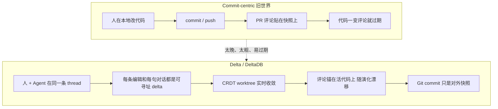

## 一句话结论

Zed 认为 **软件现在是在对话里长出来的，而不是在 commit 里长出来的**。Delta 不是又一个 PR 工具，而是一套把「对话 + 正在演化的 worktree」一起实时复制的协作环境；Git 仍负责对外发布，但已经不够当 agent 时代的工作现场。

## 一张图看懂

## 核心观点

### 1. Delta 是第二阶段：从「写代码的地方」到「讨论代码如何长成的地方」

Nathan Sobo 把 Zed 的多年路线拆成两段：

- 第一段：做最强的写软件场所（编辑器 Zed）
- 第二段：做最强的讨论软件场所（Delta）

早期在 IDE 里做对话很难卖。Agent 把这件事反过来了：**讨论不再是写完之后的附加动作，讨论本身就是代码的生产方式。**

所以 Delta 的产品定义是：

> a multiplayer environment for coding with agents and reviewing what they build

它要保证人和 agent **共享 worktree 是如何长成的完整故事**，而不是只共享最终 diff。

### 2. 真正缺的不是更好的编辑器面板，而是 DeltaDB

支撑这个模型的不是 UI，而是 **DeltaDB**：把对话和 worktree 一起实时复制的存储层，叠在你已经在用的 Git 仓库之上。

关键设计选择：

- **记录的是 commit 之间发生的事。** Git 存的是离散快照；DeltaDB 把工作拆成细粒度 delta 流，每一次中间操作都有稳定身份。
- **消息和它产生的编辑并排记录。** 从任意一行代码可以跳回写出它的对话；从任意一句对话可以跳到当时的代码，也可以跳到现在的代码。
- **不替换 Git。** `commit` / `push` 行为不变。从没打开过 Delta 的同事，看到的仍是普通 Git 仓库。`.gitignore` 里的文件不同步。
- **Agent 在真实 checkout 里工作**，不是在数据库内部改文件。可以把 worktree 挂到磁盘，继续用自己的终端和工具。

一句话：**Git 是发布协议，DeltaDB 是工作协议。**

### 3. 评论必须锚在活代码上，而不是锚在过期快照上

Commit-centric 工具的结构性缺陷是：

- 评论贴在某个 snapshot 上
- 代码一变，评论就过期
- 后来的人只能从 diff 反推意图

Delta 的做法是：

- 可以在 thread 里标注，也可以在 worktree 的任意一行标注
- 标注对象可以是昨天 agent 刚改的，也可以是几年前的人类代码
- 笔记随代码演化保持锚定，绑在「产生这些代码的讨论」上
- permalink 是字符级 / delta 级的，不是行号级的，所以后面再改也不漂

这让后续的人和 agent 看到的不只是「代码现在长什么样」，还有 **「它为什么长成这样」。**

如果看着不对，你不是回去读 PR，而是直接问当时那条 thread 里的 agent：解释，或者修。

### 4. Agent 开发默认变成多人实时，而不是「等他 push 了我再看」

Thread 默认私有，邀请后才可见。被邀请的人是完整参与者：可以探索、实时评论、稍后回来接着干。

关键变化：**worktree 本身变成可协作对象。** 每个人有一份本地副本，但会随工作实时同步。队友接手时，不必猜「最新树到底 commit 了没有、push 了没有」。

这是对 Git 协作假设的直接否定。Git 假设：

- 工作副本是私有的、脏的、不适合给别人看
- 只有 commit 之后才进入公共空间

Agent 把这个假设打碎了：大量有意义的状态发生在 uncommitted 区间，而且必须立刻被另一台机器（人或 agent）看见。

### 5. 同一份 store，从本机延到云端、浏览器、外部 harness

Delta 把协作从「装了 Zed 的人」扩成「任何能打开这条 thread 的人」：

- 可以把任务交给 cloud runner，合上笔记本，agent 继续跑；对话和文件仍跟 thread 对齐
- 一条链接就能在浏览器打开 thread，无需安装。delta.dev 不是缩水的网页仿制品，而是同一份 Rust 应用编成 WASM，用 WebGL 渲染
- 先接入外部 agent harness（从 Claude Code / ACP 开始）：人可以继续待在终端，session 实时流进 Delta thread，别人能看、能原地评论、能带完整上下文接着干

这等于承认：**agent 会话已经是一等工件**，不应该锁死在某一个客户端里。

### 6. Agent 的输出量是界面问题，不是「折叠一下就好」的问题

Agent 吐出的文本和 diff 远大于人类。主流工具的反应是隐藏：折叠 diff、截断日志、用摘要代替原文。

Zed 团队把这当成已经解决过的编辑器问题：

- diff 全开
- transcript 完整保留
- 渲染速度跟得上模型生成速度

Thread 被当成一份文档：**光标在里面到处都能用。** 回复就是把 caret 放到要指的地方再打字。备注可以绑到精确文本——某一行 diff、某一步 plan、某一段 thinking。thread 里没有「不能点」的区域，所以 agent 和队友看到的指称是精确的。

这看起来像交互细节，其实是工作流主张：**不要把 agent 的工作过程压缩成人类可读的摘要，过程本身就是要被审查、被引用、被续写的源码。**

### 7. 为什么必须做新应用，而不是塞进 Zed

他们故意很久不说 DeltaDB 会怎么交付。外界默认会进 Zed。等数据库成熟后，他们判断：

- 这套抽象需要自己生长，存储和客户端必须互相塑造
- 不能把新原语硬塞进已有编辑器
- 在「每天几十万用户」的 Zed 上重构，会破坏已经形成的习惯

所以 DeltaDB 的第一个客户端是独立应用，从一开始就围着「被复制的 thread + worktree」设计，中心不是编辑器，而是 thread。

> The thread is where software happens now.

Zed 会继续做，DeltaDB 以后也会进 Zed，但起点是这条新应用。

## 核心脉络

1. Git 按 commit 组织历史，但软件真正成形的时刻在 commit 之间
2. Agent 把「对话生成代码」变成主路径，对话必须和正在变的文件绑死
3. 因此需要细粒度、可寻址、可实时复制的 delta 流，而不是更漂亮的 PR 页
4. 评论、审查、接手、云端续跑，全部发生在活 worktree 上
5. Git / CI 留下做互操作和门禁，不再被迫充当协作现场
6. 为了让存储和交互一起长，先做新应用，而不是改旧编辑器

## 对实际工作的启发

### 对个人使用 Agent 的人

- 不要只保存最终 diff。prompt、中间失败、为什么改成这样，才是下次 agent 能复用的资产
- 「先 commit 再请人看」会系统性地丢掉 agent 工作的主过程
- 一条可分享、可续跑的 thread，比一条「请看我这个分支」的消息更接近真实协作

### 对团队

- PR 评论贴在快照上，在 agent 高频改代码时会加速腐烂
- 真正要共享的是进行中的 worktree + 产生它的对话，而不是等它变成 commit
- Git 仍然要留：对外、对 CI、对不使用 Delta 的人。但团队内部的工作协议可以先迁到 thread

### 和本库其他笔记的关系

- [[用好AI的第一步：停止和AI聊天]] 说要把 AI 放进有反馈、有上下文、能积累资产的系统。Delta 是这个主张在「协作层」的产品化：thread 就是那个系统
- [[Harness Engineering：当工程师不再写代码]] 说仓库是 Agent 的真理来源。Delta 补充了一句：仓库里的 commit 还不够，**commit 之间的对话和工作树也必须是真理来源**
- 对照 [[Cursor：Git at any scale]]：Zed 补的是语义层（对话、审查、活代码），Cursor 补的是物理层（托管、复制、弹性副本）
- 对照 [[Anthropic：The AI-native SDLC playbook]]：Delta 的 thread 很像还没被企业命名的、更细粒度的 artifact 流；Anthropic 补的是 thread 前后的闸门
- 对照 [[Warp：How Warp builds self-improving agents on Claude]]：Warp 的信号经常就住在 PR 评论和 issue 线程里；Delta 若成为工作现场，improver 的输入会更完整
- 合读判断见 [[Agent-native 软件基础设施与工作流]]

## 我认为最值得记住的三句话

- **Software now takes shape in the conversation, not the commit.**
- **Every edit and conversation is captured between your commits.**
- **The thread is where software happens now.**

## 原文标记

- 原文标题：Introducing Delta
- 作者：Nathan Sobo
- 日期：2026-08-12
- 产品：Delta（delta.dev）私人 beta；存储层是 DeltaDB
- 前置文：[Software Is Made Between Commits](https://zed.dev/blog/introducing-deltadb)（2026-06-11）把 DeltaDB 说得更清楚：CRDT worktree、字符级 permalink、从任意 delta 分支（包括 agent 跑到一半）
- 定位：补 Git，不替换 Git；先做独立应用，再回灌 Zed
