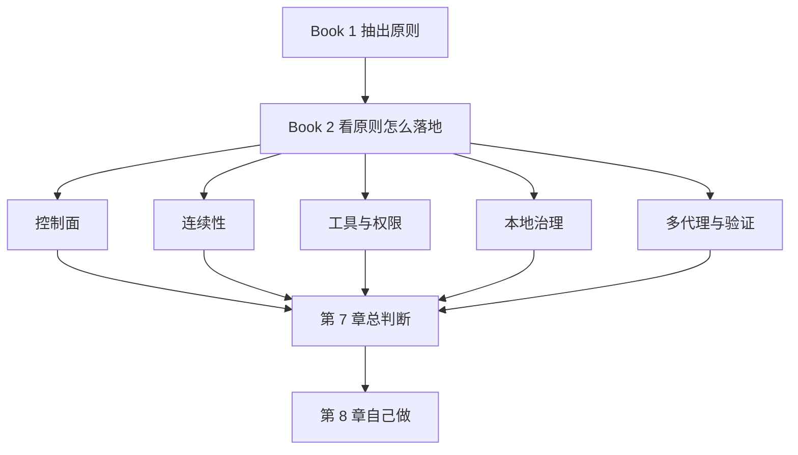

# Book2阅读导读：如何理解第一本书与这本比较书

出处

来源：<a href="https://harness-books.agentway.dev/book2-comparing/chapter-00-reading-map.html">原网页</a> · 状态：已读 · PDF：<a href="./book2-comparing.pdf"><code>book2-comparing.pdf</code></a> p.1–5

## 一句话

**第一本解释可控 agent 必须长成什么样；这本解释两套认真做 harness 的系统为什么会长得不一样。** 比较的不是功能表，是秩序安放在哪一层。

## 一张图看懂

封面那句把分歧钉死：有人把摧残写进控制流，有人把摧残写进制度层。导读三个前提：比较的重点不在模型而在 harness；harness 是权力分配，不是功能拼盘；系统差别常常不在名词，而在秩序住在哪一层。

## 核心概念

两本书并不重复。Book 1 是单体解剖：以 Claude Code 为样本，说明一套能在真实工程环境里持续工作的 harness，内部必须有控制面、主循环、工具权限、上下文治理、恢复路径、多代理验证、团队制度。Book 2 是比较解剖：把 Claude Code 和 Codex 并置，看同样承认模型不可靠之后，两边把秩序安在哪一层。

Book 1 压成九条结构判断：先约束模型别把环境弄坏；prompt 是控制平面的一部分；主循环才是心跳；工具是受审批、调度、中断约束的执行接口；上下文是预算治理；错误属于主路径；多代理的价值在职责分区与独立验证；团队要把规则沉淀成制度；最后抽出原则清单。只读第一本，会留下一个强印象：Claude Code 的气质偏运行时治理。

这本比较书把对照轴拆成五层：

| 轴 | Claude Code | Codex |
|---|---|---|
| 控制面 | 动态 prompt 装配 | 带标记的 instruction fragment |
| 连续性 | 压进主循环 | 拆成线程、rollout、状态桥 |
| 工具 | 运行时编排与现场审批 | schema、审批参数、独立策略引擎 |
| 本地治理 | 现场记忆：`CLAUDE.md`、memory、skill | 结构化资产：instructions、hooks、fingerprint |
| 多代理 | 运行时职责分区，验证独立 | 工具化委派，持久状态让复核有材料 |

带这些判断去看第三方 harness，更容易识破一种常见误区：表面上有 memory、skills、compact 和多代理，上下文治理的主轴仍是先把大量文本塞进 prompt，超了再截断补救。看起来信息更全，实际更费 token，也更容易把工作语义冲淡。那不是第三条成熟路线，是还没决定把秩序放在哪一层。

## 关键洞察

两本并读，真正清楚的是三件事。

第一，比较的对象是 harness。AI coding system 的核心挑战，首先是如何让模型在终端、文件系统、权限和团队制度里不失控。

第二，差别主要是秩序安放的位置。Claude Code 更像从运行时事故经验里塑出来，优先连续性、恢复和现场治理。Codex 更像从显式结构设计里塑出来，优先控制层命名、策略表达、边界清晰和可组合性。

第三，后来者不该照抄产品。长会话容易失控、恢复路径很脆、验证总被跳过，先学 Book 1 的运行时纪律。规则来源太散、权限边界不清、工具契约不稳定、团队很难复制同一套行为，先学 Codex 式显式控制层。

推荐顺序：序言确认比较对象 → 第 1 章建立问题意识 → 第 2 到第 6 章走完五条轴 → 只想看总判断就读第 7 章 → 要自己做再读第 8 章。AgentWay 是独立实践站点，不是这本书的下一章。

## 个人思考

Book 1 的十条原则在这里变成对照实验：同一套不信任，换一层器官，系统气质就变了。仓库里 Anthropic 的 SDLC 说人守闸门、循环自己转；Warp 说现场反馈要沉淀进 skill。Book 2 补的是：闸门和 skill 放在运行时现场，还是放进可命名、可审计的控制层，后面会长出完全不同的团队习惯。错的不是选边，是混着用，最后既没有运行时纪律，也没有清楚的控制层。

## 相关

- [[01-序言]]
- [[00-序言]]
- [[09-十条原则]]
- [[08-殊途同归还是各表一枝]]
