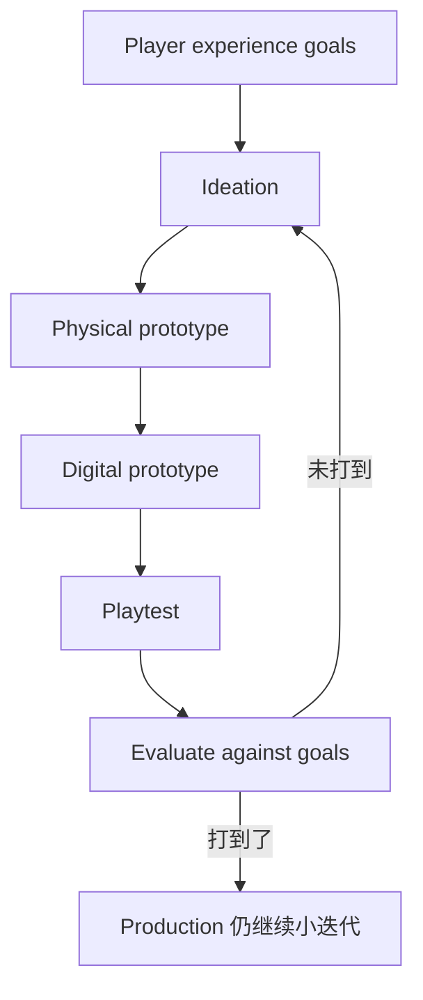

# GDW阅读地图：如何读第五版 Game Design Workshop

出处

来源：<a href="https://www.gamedesignworkshop.com/whats-new">原网页</a> · 状态：已读（骨架） · 试读：<code>game-design-workshop.pdf</code>（约 72 页；第 3 章开头被 Perlego 墙截断）

## 一句话

**这不是一本教你「想出好点子」的书，而是一本教你怎么用试玩把点子打到预先写下的玩家体验目标上的书。** 三版到五版方法没换，换的是时代语境。

## 一张图看懂

全书 16 章围着这张图转：Part 1 告诉你目标该用哪些零件写，Part 2 让你真的转一圈，Part 3 告诉你进团队以后这张图怎么不被制作吞掉。

## 核心概念

### 三大部分，不是三套理论

| 部分 | 章 | 你读完该会什么 |
|---|---|---|
| Part 1 Basics | 1–5 | 能把任意一款游戏拆成形式 / 戏剧 / 系统，并写出体验目标 |
| Part 2 Designing | 6–11 | 能从纸面原型做到试玩、平衡、乐趣与无障碍 |
| Part 3 Working | 12–16 | 能在团队、产业、推销里保住 playcentric，不被文档和发行吞掉 |

第 6 章五版改名为 **Ideation**（3/4 版叫 Conceptualization）。目录顺序不用改，课纲可以同一套。

### 三版差在语境，不差在骨架

| | 3 版 2014 | 4 版 2018 | 5 版 2024 |
|---|---|---|---|
| 行业在问 | 触控、小团队、独立、敏捷、analytics | 休闲、教育、消费级 VR、包容性团队 | 情绪向目标、生成式 AI、屏幕之外的沉浸 |
| 纸书声音 | 开始请独立设计师 | McGonigal、Anthropy、Hunicke、Takahashi | Brier、Yu、LaPensée、Straley；旧访谈搬官网 |
| 该不该换版 | 方法已够用 | 补品类和发行路径 | 现在入门买这一本 |

旧 Designer Perspectives 和部分 sidebars 在 [官网归档](https://www.gamedesignworkshop.com/designer-perspectives)，不是删了。

## 关键洞察

Fullerton 把设计师的工作定义成 **advocate for the player**，不是「把系统做完」。所以试玩不是 QA 末期的礼貌环节，而是设计主路径。Zimmerman 在第 1 章侧栏里说得更狠：先写一本穷尽一切的 design document 再开工，最终游戏几乎从不长成那份文档；迭代是用进行中的原型经验做决定。

和仓库里 Harness 笔记是同一类判断，只是对象不同：Claude Code 用 query loop 约束不稳的模型；这本书用 playtest loop 约束不稳的「我觉得好玩」。两边都拒绝一次想对。

## 个人思考

第 1–2 章已读完。第 3 章只读到玩家人数，后面是付费墙。把后续页导出叠进专题目录的 PDF 之后继续填。

## 相关

- [[01-设计师是玩家代言人]]
- [[02-游戏的结构]]
