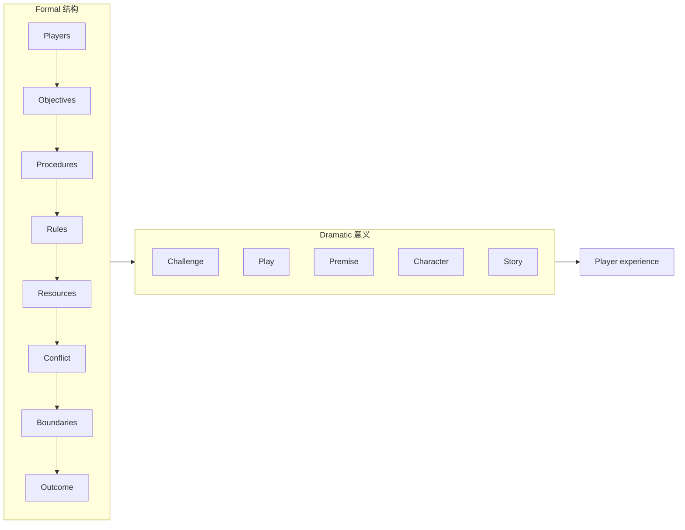

# 第 2 章：游戏的结构

出处

来源：Tracy Fullerton, <em>Game Design Workshop</em> 5th ed., Chapter 2 · 状态：已读（试读 PDF 到戏剧元素与 McGonigal / Randy Smith 访谈前） · 试读：<code>game-design-workshop.pdf</code>（第 2 章全文）

## 一句话

**Go Fish 和 Quake 看起来毫无关系，但我们仍都叫它们游戏——因为底下有一套共同的结构零件。** 设计师的工作是认清这些零件，再按体验目标去组合，而不是先发明一套新本体论。

## 一张图看懂

形式元素给体验骨架；戏剧元素让骨架对玩家有意义。第 3、4 章会分别展开。第 2 章的任务只是：让你承认它们存在。

## 核心概念

### 先自己写两款，再对照

Exercise 2.1：随便想一款游戏，写到「从没玩过这类的人能照着玩」；再想一款尽量不同的，同样写一遍；然后比差异和共同点。没有标准答案。目的是把「我认得这是游戏」从直觉里拖出来。

### Go Fish versus Quake

她故意挑两极：回合卡牌 vs 实时 3D 射击；一副扑克 vs 商业软件；公有规则 vs 版权产品。逐条对照之后，留下来的共同点就是结构。

**Players.** 体验是为玩家设计的，而且要求主动参与。音乐和戏剧里也有「演的人」，但消费主体是观众。玩家是自愿接受约束、做决策、有可能赢的人。Bernard Suits 的 **lusory attitude**：接受「用更差的手段去达到目的」——高尔夫不用手把球放进洞，而要拿棍子从几百码外打。这种自愿受虐是 playcentric 必须考虑的心理状态。

**Objectives.** Go Fish 要凑最多的 book；Quake 要活着打完关。看电影没有给你一个必须完成的目标（角色有，你没有）。生活里目标是自己定的，完不成也不算人生失败。游戏里目标是结构本身：你有多想完成它，就是你有多投入。

**Procedures.** 允许你做的动作和方法。Go Fish：一次只能向一名玩家要一个点数；Quake：走跑跳游射击捡东西。程序会逼出日常生活里不会发生的互动——现实中要四张同点，你可能一次问全桌，或去翻牌堆。你不那么做，是因为游戏权威要求你走低效路径。

**Rules.** 对象是什么、能做什么、不能做什么。和程序缠在一起，但规则更像边界条件。

试读里还继续对照了 **resources / conflict / boundaries / outcome**：Quake 的血、甲、弹药是资源；敌人与关卡危害是冲突；3D 建筑是物理边界，Go Fish 的边界更概念化（规则只在局内生效）。这些零件第 3 章会逐个变成可操作的设计旋钮。

### 形式元素不够，还要能勾住玩家

结构只解决「这是不是游戏」。勾住玩家的是挑战、玩、前提、角色、故事——她称为 **dramatic elements**。前提的最低作用是让选择可语境化，高一点则能把人情绪卷进形式互动里。Mario 的演化、*Life is Strange* 系列被拿来说明：叙事和玩结合可以做出强情绪结果，但没有唯一正确做法。

### 谜题不是另一物种，但也不等于游戏

Scott Kim 的侧栏定义谜题：**好玩，并且有正确答案。** 前半说它是玩，后半把它从游戏和玩具里切开。好谜题要新、难度卡在不太易不太难、最好有一次认知翻转。乐趣是主观的，所以谜题设计的第一份工作是裁剪给特定听众。Bernie DeKoven 的提醒也写在这里：必要时改规则，好让所有人还能 well-played。

### 认真游戏 ≠ 把生活贴一层徽章

她点名不喜欢 **gamification** 这个词：它暗示给任何系统贴游戏功能就会好玩。玩家立刻知道不是。徽章能短期催一下，但那不是这本书要的设计。serious / learning games 可以做得很深，前提仍是玩得起来，不是图层。

## 关键洞察

- **定义游戏不是为了哲学考试，是为了设计时有零件可拧。** 你认不出 players / objectives / procedures，后面的原型就只会堆功能。
- **Lusory attitude 解释了为什么「更高效」常常是坏设计。** 游戏卖的是受约束的行动，不是最短路径。
- **目标是投入的量尺。** 玩家不在乎目标，体验目标再华丽也没有载体。
- **Quake 单机和多人甚至可以被看成两款游戏**（书的尾注自己说了）。结构分析允许这种拆法，不要被包装盒骗。

## 个人思考

这一章是 Part 1 的接口层：第 1 章给了循环，第 2 章给了循环里该评估的对象。读的时候不要急着记术语表，去做 2.1–2.3——列出五款游戏的目标，比背定义有用。

试读在戏剧元素和 Jane McGonigal / Randy Smith 的 Designer Perspective 附近结束。第 3 章起需要后续正文。

## 相关

- [[01-设计师是玩家代言人]]
- [[03-形式元素]]
- [[04-戏剧元素]]
- [[00-GDW阅读导读]]
