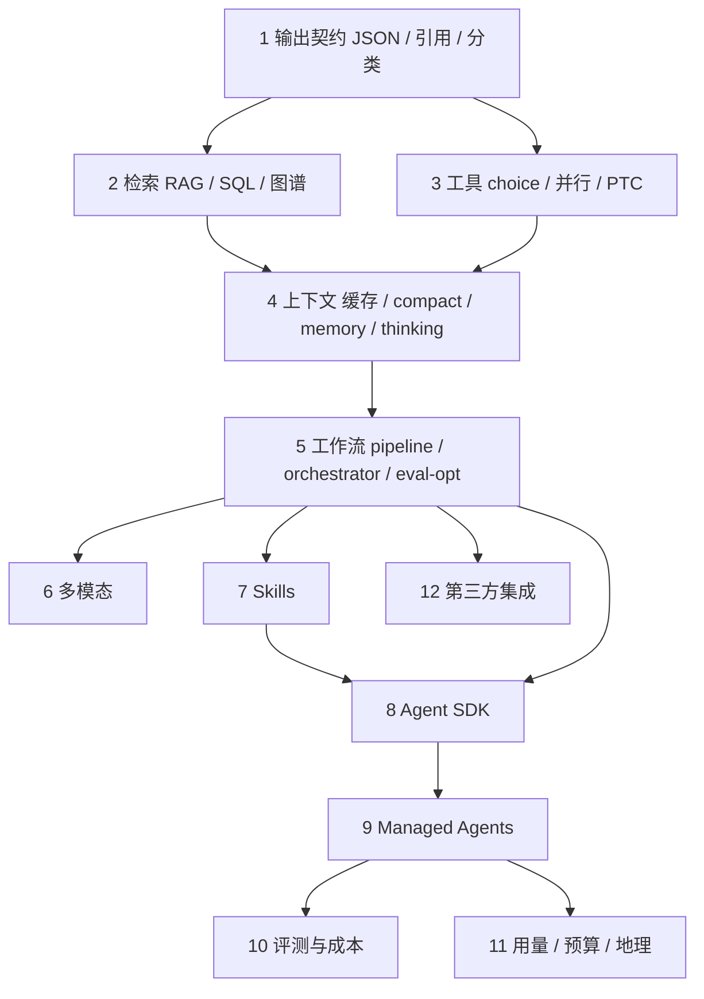

# Cookbooks阅读导读：怎么把 95 道 recipe 读成一本书

出处

来源：<a href="https://github.com/anthropics/claude-cookbooks">anthropics/claude-cookbooks</a> · 状态：已读 · 对照：<code>~/workspace2/claude-cookbooks</code>（registry 95 条，另有未登记 CMA notebook）

## 一句话

**Cookbooks 不是「Claude 会什么」的展览，而是「把不稳的模型接进真实工作流时，约束该按什么顺序钉上去」的练习册。** 上游按文件夹堆例子；这本笔记按工程依赖重排。

## 一张图看懂

先钉「交什么」，再钉「能碰什么」，再谈「怎么编排」，最后才是托管和账单。跳过前四章直接抄 SDK 示例，常见结果是 agent 能跑、不能验收。

## 核心概念

### 为什么不当成文件夹笔记

官方仓库的顶层目录是产品面切片：`capabilities/`、`tool_use/`、`claude_agent_sdk/`、`managed_agents/`……同一条工程判断会散在四处。例如「上下文装不下」同时出现在 `misc/prompt_caching`、`tool_use/automatic-context-compaction`、`tool_use/context_engineering/`。按文件夹抄，你会得到 95 篇摘要，得不到一条可执行的顺序。

这本笔记把 registry 收成 12 章，一章一个约束。recipe 清单写在各章里，不在本库复制 `.ipynb`。

### 三大部分，不是三套 API

| 部分 | 章 | 你读完该会什么 |
|---|---|---|
| Part 1 约束 | 1–4 | 能规定输出形状、检索边界、工具权限和上下文预算 |
| Part 2 工作流 | 5–7 | 能把单次调用收成 pipeline / 多代理 / Skills |
| Part 3 产品 | 8–12 | 能在 Agent SDK 或 CMA 上落地，并知道怎么评、怎么花钱、怎么接第三方 |

和 [[00-GDW阅读导读]] 同构：Fullerton 用 playtest loop 约束「我觉得好玩」；这里用输出契约 + 工具边界 + eval 约束「我觉得模型答对了」。两边都拒绝一次想对。

### 和 Harness 书怎么对

| | Book 1 Harness | 这本书 |
|---|---|---|
| 样本 | Claude Code 运行时 | Messages API / Agent SDK / CMA 的可复制 recipe |
| 控制面 | Prompt 拼装、CLAUDE.md、hook | system + tools + skills + session |
| 心跳 | query loop | 工作流图、session、subagent |
| 权限 | 工具权限与中断 | tool_choice、sandbox、CMA 预算 |
| 上下文 | compact / memory | prompt cache、compaction、memory tool |
| 验证 | 多代理拆开合成与核查 | evaluator-optimizer、outcome grader、evals |

读 Cookbooks 是为了看见 **同一套原则在 API 层怎么被拆成可运行的最小例子**。不要指望 notebook 替代 Book 1 的制度判断。

### 目录源是 registry，不是 git ls

`registry.yaml` 才是对外食谱表（写这份导读时 95 条）。仓库里还有未进 registry 的 notebook，例如：

- `managed_agents/CMA_gate_human_in_the_loop.ipynb`
- `managed_agents/CMA_explore_unfamiliar_codebase.ipynb`
- `managed_agents/CMA_orchestrate_issue_to_pr.ipynb`
- `tool_use/tool_search_alternate_approaches.ipynb`

章节清单会把它们标成「仓库内、未登记」。发现新 recipe 时改对应章的表，不必新开文件。

## 关键洞察

- **文件夹是仓储，章节是依赖。** 先会 JSON mode 再谈 customer service agent，不是品味问题，是验收顺序。
- **SDK 和 CMA 是同一套约束的两种封装。** SDK 把循环放在你的进程里；CMA 把循环、沙箱、session、预算收到服务端。第 8、9 章对照着读，不要当成两门课。
- **Evals 不是附录。** 没有评测的 agent 只能演示。第 10 章要和第 5、9 章交叉，而不是读完全书再补。
- **第三方集成是适配器，不是能力。** Pinecone / LlamaIndex / ElevenLabs 证明的是边界，不是「Claude 必须配这个库」。

## 个人思考

12 章已按依赖填完。开读仍从第 1 章输出契约进：模型一开口就可能形状不对，后面所有工具和检索都在放大这个错误。机制细节在各章，这份导读只负责顺序和对照。

对照仓库留在 `~/workspace2/claude-cookbooks`，本库只引用 GitHub 路径。不要把 notebook 拷进来——那会让笔记和上游抢真相。

## 相关

- [[01-先钉输出]]
- [[00-序言]]
- [[00-GDW阅读导读]]
