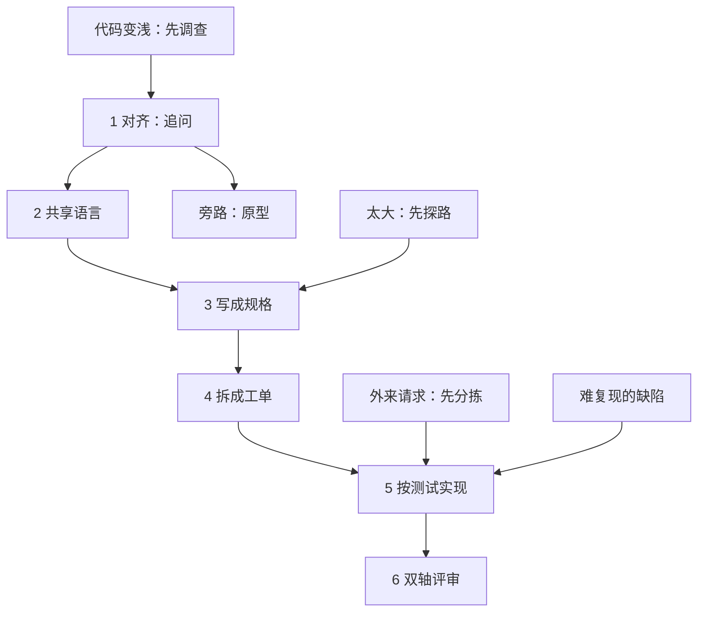

# Skills阅读导读：怎么把 25 个 skill 读成一条主链

出处

来源：<a href="https://github.com/mattpocock/skills">mattpocock/skills</a> · 状态：已读 · 对照：本机 skills 仓库，不入库 · 文档：<a href="https://aihero.dev">aihero.dev</a>

## 一句话

**这套 skill 不是「让 AI 替你管流程」，而是把工程里反复失败的那四件事拆成可组合的小件：对齐、共用一套词、给反馈、护住设计。** 上游按 engineering / productivity 分桶；这本笔记按失败模式的修复顺序重排。

## 一张图看懂

人打的是带名字的入口（`/grill-with-docs`、`/to-spec`）；模型按需去拿纪律本身（`grilling`、`tdd`、`codebase-design`）。入口可以调用纪律，入口之间不互相调用。跳过前三章直接抄 `/implement`，常见结果是 agent 能改文件、不能证明它改对了。

## 核心概念

### 为什么不当成分桶笔记

官方仓库的顶层是用途切片：`engineering/` 管写代码，`productivity/` 管非代码，`in-progress/` 是公开 beta。同一条工程判断会散在两处。例如「先问清楚再动手」同时出现在 `grill-me`、`grill-with-docs`、`grilling`；「测试该打在哪」同时出现在 `to-spec`、`tdd`、`codebase-design`。按文件夹抄，你会得到 25 篇说明书，得不到一条可执行的顺序。

路由器是 [`ask-matt`](https://github.com/mattpocock/skills/blob/main/skills/engineering/ask-matt/SKILL.md)。它把人能调用的 skill 收成一条主链、两条并入主链的入口、以及底下两套词汇。这本笔记按那张图走，不按插件清单走。

### 三大部分，不是两套文件夹

| 部分 | 章 | 你读完该会什么 |
|---|---|---|
| Part 1 对齐 | 1–4 | 能分辨四个失败模式，会用追问钉决策，会把词和规格留下来 |
| Part 2 形状 | 5–6 | 能给 agent 一条会变红的反馈，能判断模块是深还是浅 |
| Part 3 规模 | 7–9 | 能在跨会话的迷雾里探路，能在阶段边界上选走法，能把人才能做的步骤从 agent 循环里拆出去 |

和 [[00-Cookbooks阅读导读]] 是同一类判断：Cookbooks 用输出契约约束「我觉得模型答对了」；这里用追问 + 规格 + 会变红的测试约束「我觉得 agent 做对了」。两边都拒绝指望一次就做对。

### 和 Harness、Cookbooks、已有文章怎么对

| | Book 1 Harness | Cookbooks | 这本书 |
|---|---|---|---|
| 样本 | Claude Code 运行时 | Messages API / Agent SDK 的 recipe | 一套可组合的过程 skill |
| 控制面 | Prompt 拼装、CLAUDE.md、hook | system + tools + skills + session | 人打的入口 skill + 模型去拿的纪律 skill |
| 心跳 | 主循环 | 工作流图、session | grilling 的一轮、TDD 的一刀、探路图上的一张决策票 |
| 权限 | 工具权限与中断 | 工具选择、沙箱 | 决策归人、事实归 agent；人才能做的步骤走向导脚本 |
| 上下文 | compact / memory | prompt cache、compaction | 阶段边界上的五种走法：继续、清空、交接、子代理、压缩 |
| 验证 | 多代理拆开合成与核查 | evaluator-optimizer、evals | 双轴评审：规范一条轴，规格一条轴，互不掩盖 |

读这本是为了看见 **同一套「先约束再动手」在过程层怎么被拆成可调用的小件**。不要指望 skill 替代 Book 1 的运行时制度，也不要拿它替代 Cookbooks 第 7 章对 Skill 原语的说明。

[[07-Skills]] 讲的是 Skill **是什么**（三级展开、和 tool / MCP 分工）。[[构建 Claude Code 的经验：我们如何使用 Skills]] 讲怎么把规则打成工作包。这本书讲一个工程师如何把**自己的工程纪律**拆成 skill，以及它们怎么串成主链。

### 人打的入口，模型去拿的纪律

README 把整套 skill 收成一条轴：谁能调用它。

- **人打的**（`disable-model-invocation: true`，禁止模型自己开火）：编排。`grill-with-docs`、`to-spec`、`to-tickets`、`implement`、`wayfinder`、`triage`。它们可以去调纪律 skill，但彼此不互调。
- **模型去拿的**：可复用的纪律。`grilling`、`tdd`、`domain-modeling`、`codebase-design`、`code-review`。人也可以直接打，但日常是被入口带着跑。

这就是为什么 `grill-with-docs` 的 `SKILL.md` 只有一行：去调 `grilling` 和 `domain-modeling`。薄入口不是偷懒，是组合点。入口写厚了，纪律就会在两处各写一份，以后对不上。

### beta 和杂项不进正文

`in-progress/` 公开求反馈：loop-me、writing-beats、implement-spec、pr、retro……不进插件，文档页也不写，行为可以随时改。`misc/` 和 `deprecated/` 不推广。这本笔记只收 `engineering/` 和 `productivity/` 里已经晋升的那一套。发现新的稳定 skill 时改对应章，不必新开文件。

## 关键洞察

- **分桶是仓储，章节是依赖。** 先会追问再谈实现，不是品味问题，是验收顺序。
- **规格和工单是同一份决定的两种寿命。** 规格活过会话；工单按一个新窗口来切，用完可丢。把探路图直接丢给 `/implement`，等于扔掉「把决定收成一份可建造物」那一步。
- **反馈不是测试文件的数量。** 第 5 章的诊断 skill 把「先读代码再猜」整段堵住：没有一条已经跑红过的命令，就没有下一阶段。
- **设计是每天的调查，不是泥球攒够了再抢救。** `improve-codebase-architecture` 自己写明：它是调查，不是救援。

## 个人思考

9 章已按依赖填完。开读仍从第 1 章四个失败模式进：agent 一动手就可能在错的问题上用力，后面所有工单和测试都在放大这个错误。机制细节在各章，这份导读只负责顺序和对照。

官方 skill 留在本机的 skills 仓库，本库只引用 GitHub 路径。不要把 `SKILL.md` 拷进来——否则笔记和官方仓库会各写一份，以后对不上。

## 相关

- [[01-四个失败模式]]
- [[00-Cookbooks阅读导读]]
- [[00-序言]]
- [[07-Skills]]
- [[构建 Claude Code 的经验：我们如何使用 Skills]]
